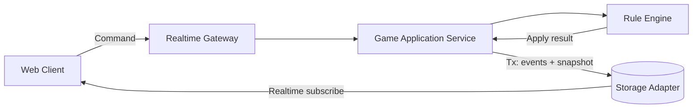
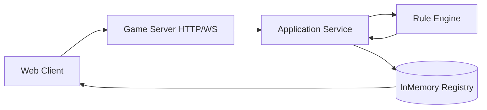

# Merchant Architecture

## 1. 문서 목적

이 문서는 스플렌더 웹 게임(`merchant`)의 기준 아키텍처를 정의한다.
핵심 목표는 다음 세 가지다.

- 실시간 멀티플레이에서의 일관성 유지
- 치팅 방지 및 서버 권위 보장
- 에이전트 기반 개발에 적합한 명확한 경계 설정

이 문서는 구현 세부사항보다 **경계(boundary), 책임(responsibility), 흐름(flow)**을 우선한다.

## 2. 설계 원칙

### 2.1 Server-Authoritative Game

- 클라이언트는 상태를 직접 변경하지 않는다.
- 클라이언트는 `Command`(의도)만 전송한다.
- 서버만 게임 룰을 평가하고 `Event`를 생성한다.

### 2.2 Deterministic Rule Engine

- 룰 엔진은 순수 함수로 설계한다.
- 동일한 입력(`state`, `command`, `seed`)은 동일한 결과를 반환해야 한다.
- 랜덤 요소(덱 셔플)는 seed를 통해 재현 가능해야 한다.

### 2.3 Append-Only Event + Snapshot Read Model

- 정답 소스는 이벤트 로그(`events`)와 버전(`version`)이다.
- 클라이언트 렌더링 최적화를 위해 스냅샷(`games`)을 유지한다.
- 필요하면 스냅샷은 이벤트로부터 재구성 가능해야 한다.

### 2.4 Mechanical Guardrails

- 아키텍처 규칙은 문서에만 두지 않는다.
- 패키지 의존성 규칙, 타입 경계, 테스트 게이트로 강제한다.

현재 적용된 guardrail:

- ESLint `no-restricted-imports`로 레이어/패키지 경계 강제
- `apps/game-server`의 `application`/`presentation`에서 infra 구현 직접 import 차단
- Turborepo `test`, `test:watch`, `test:coverage` 파이프라인 연결
- Vitest workspace 기반 패키지 단위 테스트 실행 표준화
- Vitest `passWithNoTests` 전역 비활성화, 필요한 패키지에만 명시적 예외 적용

### 2.5 Agent-Friendly Repository

- 설계 문서, 실행 계획, 품질 지표를 레포 내 표준 위치에 둔다.
- 에이전트가 "어디를 읽고, 어디를 수정해야 하는지" 빠르게 판단할 수 있어야 한다.

## 3. 시스템 컨텍스트



### 구성 요소 설명

- `Web Client`: UI 렌더링, 사용자 입력, 서버 응답 표시
- `Realtime Gateway`: 인증/세션 검사, 명령 수신/팬아웃
- `Game Application Service`: 트랜잭션 경계, 버전 검증, 멱등성 처리
- `Rule Engine`: 게임 규칙 계산(순수 로직)
- `Storage Adapter`: 게임 스냅샷/이벤트/명령 로그 저장 및 구독

### 3.1 로컬 개발 모드 (InMemory Registry)

로컬 개발에서는 Firestore 대신 `packages/infra-firestore`의 InMemory Registry를 사용한다.
핵심은 저장 구현만 바꾸고, `game-server`의 오케스트레이션 순서와 룰엔진 호출 경계는 유지하는 것이다.



## 4. Turborepo 구조 (2026-02-13 기준)

### 현재 상태

- `apps/web`: 플레이어 클라이언트
- `apps/game-server`: Realtime Gateway + Application Service + 로컬 HTTP/WS 런타임
- `packages/ui`: 공용 UI 컴포넌트
- `packages/shared-types`: Command/Event/State 타입 경계
- `packages/rule-engine`: 순수 룰 엔진 계층
- `packages/infra-firestore`: Storage adapter 계층(로컬 InMemory/Firestore 구현 단일 위치)
- `packages/test-fixtures`: 테스트 시나리오/빌더 계층
- `packages/eslint-config`
- `packages/typescript-config`

## 5. 데이터 모델 (Firestore)

```text
games/{gameId}
  - status: WAITING | IN_PROGRESS | ENDED
  - version: number
  - seed: string
  - currentPlayerId: string
  - board: {...}
  - players: {...}
  - createdAt, updatedAt

games/{gameId}/commands/{commandId}
  - commandType: TAKE_TOKENS | BUY_CARD | RESERVE_CARD | ...
  - actorId: string
  - expectedVersion: number
  - payload: object
  - idempotencyKey: string
  - createdAt

games/{gameId}/events/{eventId}
  - eventType: TOKENS_TAKEN | CARD_BOUGHT | CARD_RESERVED | TURN_ENDED | ...
  - actorId: string
  - version: number
  - payload: object
  - createdAt
```

### 모델 규칙

- `games.version`은 단조 증가한다.
- 하나의 `command`는 최대 한 번만 적용된다(멱등성).
- `events.version`은 `games.version`과 동일한 증가 규칙을 따른다.
- 클라이언트는 `games`/`events` 읽기만 가능하고, 쓰기는 `commands`만 허용한다.

## 6. 액션 처리 시퀀스

1. 클라이언트가 `Command` 제출
2. Gateway가 인증/게임 참가 여부 확인
3. Application Service가 `idempotencyKey` 중복 검사
4. 최신 `games` 스냅샷과 `expectedVersion` 비교
5. Rule Engine으로 유효성 검사 + 이벤트 산출
6. Storage 트랜잭션으로 `events` append + `games` snapshot 갱신
7. 구독 중인 클라이언트에 상태 반영

## 7. 동시성 및 충돌 전략

- 버전 충돌: `expectedVersion` 불일치 시 command 거절
- 재시도 정책: 클라이언트는 최신 상태 수신 후 명시적으로 재시도
- 멱등 처리: 동일 `idempotencyKey` 재전송은 동일 결과 반환
- 게임 단위 직렬화: 같은 `gameId` 명령은 논리적으로 직렬 처리

## 8. 보안 경계

### 인증

- 운영 모드: Firebase Auth 또는 동등한 토큰 기반 인증 사용
- 로컬 모드: `x-user-id` 기반 mock 인증 사용
- 모든 Command는 `actorId == auth.uid`를 강제

### Firestore Security Rules

- `games/*`: 클라이언트 직접 쓰기 금지
- `events/*`: 클라이언트 직접 쓰기 금지
- `commands/*`: 게임 참가자만 생성 허용, 수정/삭제 금지

### 서버 측 검증

- 참가자 권한
- 턴 소유권
- 자원(보석/골드) 충분성
- 카드 구매 가능성
- 귀족 방문 조건

## 9. 관심사 분리의 실제 적용

상세 규칙은 `/docs/concerns-and-boundaries.md`를 따른다. 핵심만 요약하면:

- UI는 도메인 규칙을 재구현하지 않는다.
- Rule Engine은 I/O를 모른다.
- Application Service만 트랜잭션과 외부 인프라를 다룬다.
- Infra 계층은 도메인 타입을 저장/조회만 수행하고 비즈니스 판단을 하지 않는다.

## 10. 단계별 구현 전략

### Phase 1 (MVP)

- 2인 실시간 플레이
- `TAKE_TOKENS`, `BUY_CARD`, `RESERVE_CARD`, 턴 종료
- 게임 종료 및 승점 계산

### Phase 2

- 재접속/복구
- 이벤트 리플레이 기반 관전
- 기본 전적

### Phase 3

- 랭크/매칭
- 운영 대시보드
- 성능 최적화(핫 게임 샤딩, 캐시)

## 11. 운영 지표 (초기 목표)

- Command 접수 -> 상태 반영 지연: p95 250ms 이하
- 잘못된 Command 비율: 5% 이하(UX 개선 지표)
- 중복 Command 처리 오류: 0건
- 룰 엔진 결정론 테스트 통과율: 100%

## 12. 문서 연결

- 경계 상세: `docs/concerns-and-boundaries.md`
- 에이전트 운영: `docs/agent-harness.md`
- 품질 추적: `docs/quality/QUALITY_SCORE.md`
