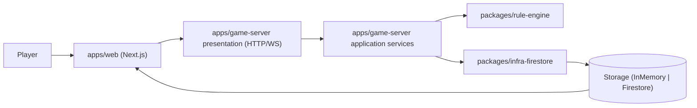
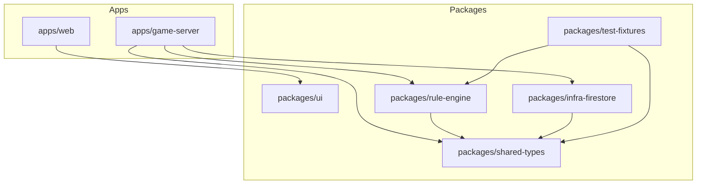
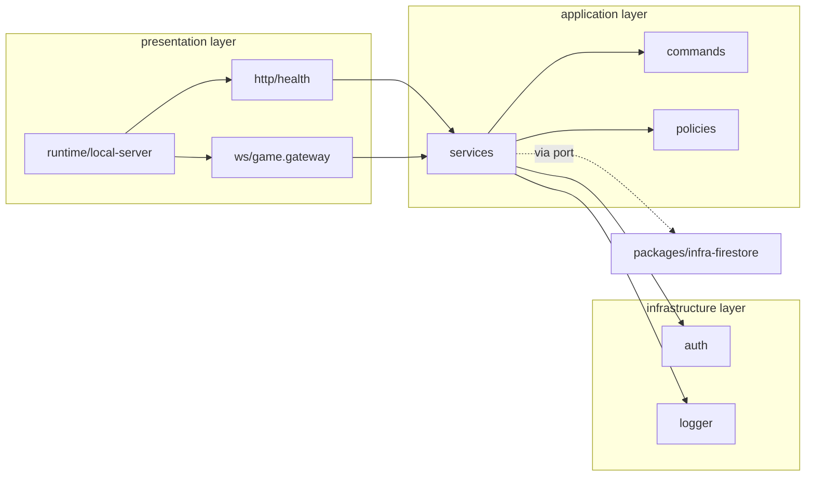
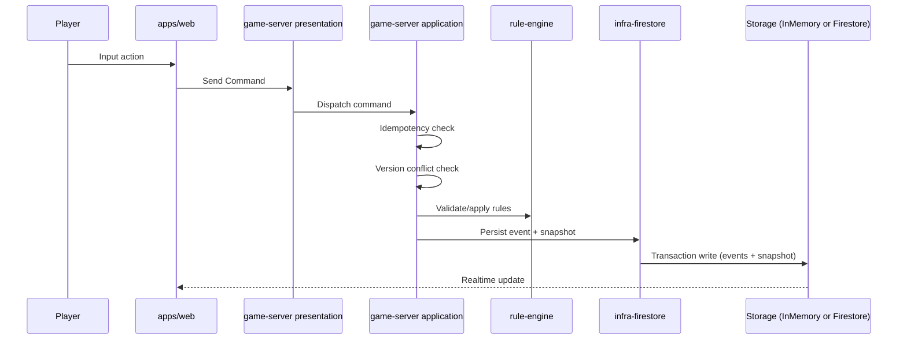
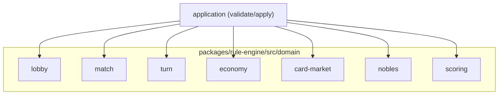
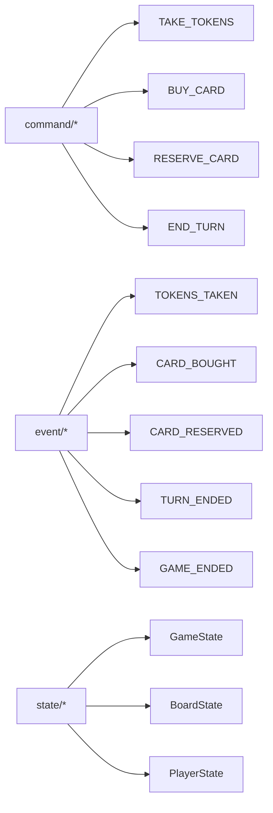

# Implementation Architecture Visualization

기준일: 2026-02-13

이 문서는 현재 `merchant` 레포의 **구현 기준 아키텍처(스캐폴딩 포함)**를 시각화한다.
실제 코드 구현 여부와 무관하게, 현재 고정된 경계/의존 흐름을 보여준다.

## 1) Runtime Flow (Command -> Event/Snapshot)

## 2) Monorepo Package Dependency View

## 3) `apps/game-server` Layer Boundary

## 4) Command Handling Sequence

## 5) Splendor Domain Slice (Rule Engine)

## 6) Shared Types Coverage (Phase 1 중심)

## 7) Notes

- 로컬 개발 경로에서는 `packages/infra-firestore`의 InMemory Registry를 사용한다.
- Firestore 저장소 구현 경계는 `packages/infra-firestore` 단일 위치로 유지한다.
- `apps/game-server`의 `application`/`presentation`은 ESLint로 infra 직접 import를 제한한다.
