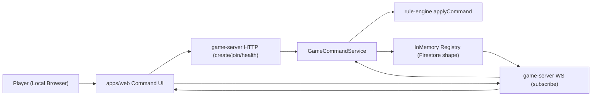

# feat: 로컬 실게임 런타임 구축 (InMemory Registry 우선)

## Overview

현재 레포는 `rule-engine`과 `game-server` 오케스트레이션 핵심(`idempotency -> version check -> applyCommand -> persist`)까지는 구현되어 있다. 하지만 실제 네트워크 런타임, 조회/구독 경로, 웹 클라이언트 연결이 비어 있어 "로컬에서 플레이 가능한 게임"이 아직 성립하지 않는다.

이번 계획의 목표는 Firestore 실연동 대신 **InMemory Registry를 Firestore 대체 저장소로 사용**해 로컬 개발에서 즉시 동작하는 게임 루프를 완성하는 것이다.

## Idea Refinement Notes

- 브레인스토밍 문서 확인: `docs/brainstorms/2026-02-12-solo-bot-hybrid-brainstorm.md`.
- 주제 자체(봇/LLM)는 이번 작업과 직접 일치하지 않지만, 다음 결정은 본 계획에 적용한다.
- 서버 권위 유지, 클라이언트는 Command만 전송 (`docs/brainstorms/2026-02-12-solo-bot-hybrid-brainstorm.md:9`).
- 사용자 제약: "Firestore는 InMemory Registry로 우선 로컬 개발"을 기본 전제로 고정.

## Research Decision

- 외부 리서치는 이번 턴에서 생략한다.
- 이유: 고위험 보안/결제/개인정보 영역이 아니고, 레포 내부 아키텍처/기존 계획/테스트 정보만으로 구현 방향을 충분히 확정 가능하다.

## Repository Research Summary

### Architecture & Structure

- 서버 권위, 룰 엔진 순수성, 이벤트+스냅샷 모델이 문서로 고정되어 있다 (`ARCHITECTURE.md`, `docs/concerns-and-boundaries.md`).
- 구현 순서 문서 `DD-0002`는 Step 6(`game-server` 연결)까지 정의되어 있으며, 현재 코드도 해당 범위는 대부분 반영되었다 (`docs/design-docs/DD-0002-splendor-rule-implementation-order.md:76`).

### Current Implementation Snapshot

1. 완료된 축
- 커맨드 처리 핵심 서비스는 동작한다.
- `apps/game-server/src/application/services/game-command.service.ts:84`
- `apps/game-server/src/application/services/game-command.service.ts:120`
- `apps/game-server/src/application/services/game-command.service.ts:131`
- 룰 엔진 `applyCommand`는 4개 Phase 1 커맨드 상태전이를 처리한다.
- `packages/rule-engine/src/application/apply-command.ts:82`
- `packages/rule-engine/src/application/apply-command.ts:128`
- `packages/rule-engine/src/application/apply-command.ts:135`
- 인메모리 커맨드 저장소는 존재한다.
- `apps/game-server/src/infrastructure/repositories/in-memory-command-handler.repo.ts:14`
- `apps/game-server/src/infrastructure/repositories/in-memory-command-handler.repo.ts:31`
- `apps/game-server/src/infrastructure/repositories/in-memory-command-handler.repo.ts:61`

2. 미완료/공백 축
- 네트워크 런타임 엔트리(HTTP/WS listen) 부재.
- `apps/game-server/src` 내 `listen()`/실서버 구동 코드 검색 결과 없음.
- `apps/game-server/package.json`에 `dev`/`start` 스크립트 없음 (`apps/game-server/package.json:6`).
- 조회/환경/헬스 파일이 비어 있다.
- `apps/game-server/src/bootstrap/env.ts`
- `apps/game-server/src/application/services/game-query.service.ts`
- `apps/game-server/src/presentation/http/health/health.route.ts`
- `apps/game-server/src/presentation/http/health/health.controller.ts`
- Firestore adapter 패키지는 대부분 스텁 상태다.
- `packages/infra-firestore/src/index.ts:1`에서 `game.mapper`만 export
- `packages/infra-firestore/src/repositories/game.repository.ts` (empty)
- `packages/infra-firestore/src/repositories/event.repository.ts` (empty)
- `packages/infra-firestore/src/repositories/command.repository.ts` (empty)
- `packages/infra-firestore/src/transactions/game.transaction.ts` (empty)
- 웹은 기본 템플릿 화면으로 게임 기능이 없다.
- `apps/web/app/page.tsx:21`
- `apps/web/app/page.tsx:35`
- `apps/web/app/page.tsx:41`

3. 품질 신호
- Runtime Reliability 점수 1/5로 운영 가능성이 낮다 (`docs/quality/QUALITY_SCORE.md:17`).
- 테스트는 주로 단위/서비스 계층에 집중되어 있고 런타임 통합 검증이 부족하다.
- `apps/game-server/tests/application/game-command.service.spec.ts:38`
- `apps/game-server/tests/application/command-dispatcher.service.spec.ts:7`

### Documentation Insights

- 경계 규칙상 `application -> infrastructure`는 port를 통한 간접 접근이어야 하며 direct import 금지 (`docs/concerns-and-boundaries.md`).
- 의미 있는 코드 변경 후 `pnpm lint`, `pnpm check-types`, `pnpm test`는 필수다 (`AGENTS.md`).

### Templates Found

- `.github` 이슈 템플릿은 현재 레포에 없다.
- 계획 문서는 `docs/plans/` 네이밍 규칙과 frontmatter를 사용 중이다.

## Institutional Learnings Search Results

### Search Context

- Feature/Task: 로컬에서 실제 플레이 가능한 게임 런타임 구축 + InMemory Registry 기반 Firestore 대체 경로.
- Keywords Used: `game-server`, `rule-engine`, `shared-types`, `workflow`, `contract`, `idempotency`, `splendor`.
- Files Scanned: 3
- Relevant Matches: 3

### Critical Patterns (Always Check)

- `docs/solutions/patterns/critical-patterns.md` 파일은 현재 없음.
- 후속으로 패턴 파일을 신설해 "필수 예방 규칙"을 중앙화할 필요가 있다.

### Relevant Learnings

#### 1. Scenario Expected Outcome Contract Sync
- File: `docs/solutions/workflow-issues/scenario-expected-outcome-contract-sync-20260213.md`
- Relevance: 룰엔진/서버 계층에서 fixture 기반 단일 기대 계약을 유지해야 드리프트를 방지한다.
- Key Insight: 레이어별 테스트가 동일 fixture `expected`를 소비하도록 강제해야 회귀 탐지가 안정된다.

#### 2. Contract Drift Shared-types
- File: `docs/solutions/workflow-issues/contract-drift-shared-types-20260213.md`
- Relevance: 런타임 연결 단계에서 이벤트/스냅샷 계약의 canonical 필드를 단일화해야 한다.
- Key Insight: 레거시 호환(`finalRound`)은 mapper에서 기본값 주입으로 처리하고, 임시 fallback으로 계약 결함을 숨기지 않는다.

#### 3. Rule Policy Input Validation Gaps
- File: `docs/solutions/logic-errors/invalid-score-map-and-unnecessary-token-return-rule-engine-20260213.md`
- Relevance: 서버 런타임이 추가되어도 정책 실패를 generic 처리하지 말고 구체 코드로 유지해야 한다.
- Key Insight: 입력 결함은 조기 실패 + 명시 코드 + 회귀 테스트로 고정한다.

## SpecFlow Analysis

### User Flow Overview



1. 로컬 세션 시작: 웹이 로컬 서버에 게임 생성/참가 요청.
2. 상태 동기화: 웹이 WS 채널 구독 후 초기 스냅샷 수신.
3. 커맨드 제출: 웹이 Command(`expectedVersion`, `idempotencyKey` 포함) 전송.
4. 서버 판정: `idempotency -> version -> applyCommand -> persist`.
5. 결과 팬아웃: 갱신 스냅샷/이벤트를 구독 클라이언트에 push.
6. 충돌/오류: `VERSION_CONFLICT`, `POLICY_VIOLATION` 등 구조화 응답.
7. 재접속: 웹이 최신 스냅샷 재수신 후 계속 진행.

### Flow Permutations Matrix

| 축 | 케이스 | 기대 동작 |
| --- | --- | --- |
| 참여 경로 | 새 게임 생성 | 시드 상태 저장 후 즉시 구독 가능 |
| 참여 경로 | 기존 게임 참가 | 최신 snapshot 제공 |
| 커맨드 | 정상 | accepted + version 증가 + broadcast |
| 커맨드 | 중복 idempotency | replayed + 추가 상태변화 없음 |
| 커맨드 | stale expectedVersion | rejected(VERSION_CONFLICT) |
| 권한 | auth.userId != actorId | gateway reject(UNAUTHORIZED_ACTOR) |
| 연결 | WS 끊김 후 재접속 | snapshot 재동기화 |
| 로컬 저장소 | 프로세스 재시작 | 메모리 데이터 초기화(명시적 비영속) |

### Missing Elements & Gaps

1. Runtime
- Gap: HTTP/WS listen 엔트리와 lifecycle 관리 부재.
- Impact: 로컬에서 웹-서버 통합 플레이 불가.

2. Query/Subscription
- Gap: 조회 서비스/구독 포트 부재.
- Impact: 커맨드 성공 후 화면 동기화 경로 없음.

3. Storage Adapter
- Gap: `infra-firestore`의 repository/transaction 파일 미구현.
- Impact: "Firestore 형태의 저장소 경계"를 로컬에서 재현하지 못함.

4. Web Integration
- Gap: 웹이 게임 상태를 표시/명령 전송하지 않음.
- Impact: 유저 관점에서 게임 기능 체감 불가.

5. Test Coverage
- Gap: 런타임 통합 테스트(E2E 성격) 부재.
- Impact: 실제 동작 경로 회귀를 놓칠 가능성 높음.

### Critical Questions Requiring Clarification

1. Critical
- 질문: 로컬 MVP에서 "게임 생성 API"를 포함할지, 고정 fixture gameId 1개로 시작할지?
- 왜 중요: 서버-웹 연결 진입점 설계가 달라진다.
- 미응답 시 가정: `POST /local/games` 생성 API를 제공하고, 기본 시드를 자동 주입한다.

2. Important
- 질문: 로컬 auth는 실제 Firebase 토큰 검증이 필요한지, `x-user-id` 헤더 기반 mock auth로 충분한지?
- 왜 중요: 개발 속도와 구조 일관성의 균형 지점이다.
- 미응답 시 가정: 로컬 모드에서는 `x-user-id` mock auth를 사용하고 production auth와 포트 분리한다.

3. Important
- 질문: 한 브라우저 내 다중 플레이어 전환 UI가 필요한지, 탭 2개(각각 player-1/player-2) 방식으로 제한할지?
- 왜 중요: 웹 UI 복잡도와 구현 범위가 크게 달라진다.
- 미응답 시 가정: 탭 분리 방식(플레이어 고정)으로 MVP를 단순화한다.

## Decision Locks (Default)

- Lock 1: 로컬 MVP는 `POST /local/games` 생성 API를 포함한다.
- Lock 2: 로컬 인증은 `x-user-id` mock auth를 사용한다.
- Lock 3: 플레이어 전환은 탭 분리 방식(탭당 1플레이어)으로 제한한다.
- Lock 4: InMemory Registry 구현 위치는 `packages/infra-firestore`로 고정한다.
- Lock 5: 서버 push는 WS로 처리하고, 클라이언트 폴링 fallback은 MVP 범위에서 제외한다.
- Lock 6: Firestore 실연동, Firebase Auth 실검증, 멀티프로세스 동시성은 이번 단계에서 제외한다.

## MVP Contract (HTTP/WS)

### HTTP Endpoints

1. `GET /health`
- 200 응답:
```json
{
  "ok": true,
  "mode": "local-inmemory",
  "time": "2026-02-13T00:00:00.000Z"
}
```

2. `POST /local/games`
- 요청:
```json
{
  "playerIds": ["player-1", "player-2"],
  "seed": "optional-seed"
}
```
- 201 응답:
```json
{
  "gameId": "game-xxx",
  "state": {},
  "playerOrder": ["player-1", "player-2"]
}
```

3. `GET /local/games/:gameId`
- 200 응답:
```json
{
  "gameId": "game-xxx",
  "state": {}
}
```

4. `POST /local/games/:gameId/commands`
- 헤더: `x-user-id: player-1`
- 요청:
```json
{
  "command": {}
}
```
- 200 응답:
```json
{
  "ok": true,
  "result": {}
}
```

### WS Message Types

1. Client -> Server
- `SUBSCRIBE_GAME`
- `UNSUBSCRIBE_GAME`

2. Server -> Client
- `GAME_SNAPSHOT`
- `GAME_EVENTS`
- `COMMAND_RESULT`
- `ERROR`

3. Message Envelope
```json
{
  "type": "GAME_SNAPSHOT",
  "gameId": "game-xxx",
  "payload": {}
}
```

## Proposed Solution

### A. InMemory Registry를 Firestore Adapter 형태로 구현

목표: Firestore 실연동 없이도 `games/commands/events` 구조를 로컬 메모리에서 동일 개념으로 운영.

대상 파일:
- `packages/infra-firestore/src/repositories/game.repository.ts`
- `packages/infra-firestore/src/repositories/command.repository.ts`
- `packages/infra-firestore/src/repositories/event.repository.ts`
- `packages/infra-firestore/src/transactions/game.transaction.ts`
- `packages/infra-firestore/src/index.ts`

핵심:
- command 로그, snapshot, event append를 하나의 트랜잭션 함수로 묶는다.
- 기존 `GameCommandRepositoryPort`를 구현하는 adapter를 제공한다.
- 이후 실 Firestore 전환 시 port/contract는 유지하고 구현체만 교체한다.

### B. game-server 로컬 런타임(HTTP + WS) 추가

대상 파일:
- `apps/game-server/src/bootstrap/env.ts`
- `apps/game-server/src/application/services/game-query.service.ts`
- `apps/game-server/src/presentation/http/health/health.controller.ts`
- `apps/game-server/src/presentation/http/health/health.route.ts`
- `apps/game-server/src/presentation/ws/game.gateway.ts` (transport binding 보강)
- `apps/game-server/src/runtime/local-server.ts` (신규)
- `apps/game-server/src/main.ts` (신규)
- `apps/game-server/package.json`

핵심:
- 헬스/게임생성/게임조회/커맨드 제출 API를 최소 구성으로 제공.
- WS 구독으로 snapshot/event push.
- `bootstrapApp`에서 InMemory Registry 주입.

### C. 웹을 플레이어 클라이언트 MVP로 교체

대상 파일:
- `apps/web/app/page.tsx`
- `apps/web/app/page.module.css`
- `apps/web/app/globals.css`
- `apps/web/src/lib/game-client.ts` (신규)
- `apps/web/src/lib/idempotency.ts` (신규)

핵심:
- 기본 템플릿을 제거하고 게임 상태 보드 + 명령 버튼 + 에러 상태 표시를 제공.
- `expectedVersion`/`idempotencyKey`를 클라이언트에서 생성해 서버로 전송.
- WS 업데이트 수신 시 UI 상태를 동기화한다.

### D. 테스트 및 관측 강화

대상 파일:
- `apps/game-server/tests/runtime/local-server.integration.spec.ts` (신규)
- `apps/game-server/tests/presentation/game-gateway.spec.ts` (신규)
- `packages/infra-firestore/tests/repositories/in-memory-registry.spec.ts` (신규)
- `apps/web/tests/local-game-flow.spec.tsx` (신규)

핵심:
- "웹/서버/저장소"를 분리해서 테스트하되, 최소 1개는 통합 시나리오로 실제 왕복을 검증.
- 로그 필드에 `gameId`, `commandType`, `resultKind`, `version`을 고정해 디버깅 가능성 확보.

## Out Of Scope (This Iteration)

- Firestore SDK 실연동 및 보안 규칙 적용
- Firebase Auth/JWT 실검증
- 봇/LLM 의사결정 통합
- 관전 모드/리플레이 타임라인
- 매칭/방 목록/랭크
- 멀티프로세스 또는 분산 락 기반 동시성 보장

## Implementation Phases

### Phase 1: Storage Foundation (InMemory Registry)

- [x] `packages/infra-firestore/src/repositories/game.repository.ts`에 `saveSnapshot/loadSnapshot` 구현
- [x] `packages/infra-firestore/src/repositories/command.repository.ts`에 idempotency key 기록/조회 구현
- [x] `packages/infra-firestore/src/repositories/event.repository.ts`에 append/list 구현
- [x] `packages/infra-firestore/src/transactions/game.transaction.ts`에 원자 연산 함수 구현
- [x] `packages/infra-firestore/src/index.ts`에 로컬 registry export 추가
- [x] `packages/infra-firestore/tests/repositories/in-memory-registry.spec.ts` 테스트 추가

DoD:
- command 중복키/스냅샷 저장/이벤트 append가 단일 코드 경로로 검증된다.
- `GameCommandRepositoryPort`를 충족하는 adapter를 서버에 주입할 수 있다.

### Phase 2: game-server Runtime Completion

- [x] `apps/game-server/src/bootstrap/env.ts`에 로컬 포트/모드 설정 구현
- [x] `apps/game-server/src/application/services/game-query.service.ts`에 snapshot 조회 서비스 구현
- [x] `apps/game-server/src/presentation/http/health/health.controller.ts` 구현
- [x] `apps/game-server/src/presentation/http/health/health.route.ts` 구현
- [x] `apps/game-server/src/runtime/local-server.ts`(신규)에서 HTTP+WS 서버 시작/종료 구현
- [x] `apps/game-server/src/main.ts`(신규) 실행 엔트리 구현
- [x] `apps/game-server/package.json`에 `dev`/`start`/`start:local` 스크립트 추가

DoD:
- `pnpm --filter game-server dev`로 서버가 기동된다.
- `GET /health`와 `POST /local/games/:gameId/commands`가 수동 호출로 동작한다.

### Phase 3: Web Playable MVP

- [x] `apps/web/app/page.tsx`를 Command UI + 상태판으로 교체
- [x] `apps/web/src/lib/game-client.ts`(신규)에서 HTTP/WS 클라이언트 구현
- [x] `apps/web/src/lib/idempotency.ts`(신규)에서 키 생성 유틸 구현
- [x] `apps/web/tests/local-game-flow.spec.tsx`에 렌더/명령 흐름 테스트 추가

DoD:
- 브라우저 2탭으로 player-1/player-2 접속 시 같은 게임 상태를 본다.
- 한 탭에서 보낸 커맨드 결과가 다른 탭에 반영된다.

### Phase 4: End-to-End Hardening

- [x] `apps/game-server/tests/runtime/local-server.integration.spec.ts`에서 create -> command -> broadcast 통합 검증
- [x] `apps/game-server/tests/presentation/game-gateway.spec.ts`에서 auth mismatch/에러 매핑 검증
- [x] `README.md`에 로컬 실행 가이드(`pnpm dev`, 테스트 계정, 포트) 갱신
- [x] `ARCHITECTURE.md`와 `docs/implementation-architecture-visualization.md`를 InMemory Registry 로컬 모드 반영으로 동기화

DoD:
- 필수 검증 명령(`pnpm lint`, `pnpm check-types`, `pnpm test`)이 모두 통과한다.
- 문서 업데이트 후 계획-구현-문서 간 충돌이 없다.

## Technical Considerations

1. 경계 준수
- `application`은 여전히 port만 의존.
- local registry 구현은 `infrastructure` 또는 `packages/infra-firestore`에 위치.

2. 결정론 유지
- 시드/덱 컨텍스트는 서버 저장소에서 단일 소스로 읽는다.
- 클라이언트가 덱 결정을 추정하지 않는다.

3. 실패 분류 유지
- 기존 `GameCommandRejectedReason`을 확장하더라도 semantic을 깨지 않는다.
- `POLICY_VIOLATION`의 `policyCode` 노출 유지.

4. 로컬 모드 제약 명시
- 프로세스 재시작 시 메모리 초기화.
- 동시성은 단일 프로세스 기준으로 먼저 보장.

## Acceptance Criteria

- [x] 로컬 서버 실행 시 `health` 응답이 정상 동작한다.
- [x] 웹에서 게임 생성/참가 후 초기 스냅샷을 수신한다.
- [x] 웹에서 `TAKE_TOKENS`, `RESERVE_CARD`, `BUY_CARD`, `END_TURN` 명령을 전송해 상태가 갱신된다.
- [x] 동일 idempotency key 재전송 시 `replayed` 결과로 처리되고 추가 상태 변화가 없다.
- [x] stale version 전송 시 `VERSION_CONFLICT`가 반환되고 UI에 재시도 안내가 표시된다.
- [x] auth 불일치 시 `UNAUTHORIZED_ACTOR`가 반환된다.
- [x] `pnpm lint`, `pnpm check-types`, `pnpm test`가 통과한다.

## Success Metrics

- Runtime Reliability 지표를 1/5에서 최소 3/5 이상으로 상향 가능해야 한다.
- 로컬 2탭 플레이 기준 커맨드 반영 지연 p95 500ms 이하.
- 통합 시나리오 테스트에서 flaky 재현율 0%.

## Dependencies & Risks

### Dependencies

- 선행 구현 완료 상태 활용:
- `docs/plans/2026-02-12-feat-apply-command-state-transition-plan.md`
- `docs/plans/2026-02-12-feat-game-server-orchestration-connection-plan.md`
- `docs/plans/2026-02-12-feat-rule-engine-test-fixture-expansion-plan.md`

### Risks

1. Risk: InMemory Registry가 Firestore semantics와 과도하게 달라질 수 있음.
- Mitigation: repository/transaction API를 Firestore shape(`games/commands/events`)로 맞추고 테스트로 계약 고정.

2. Risk: 웹 MVP 범위가 커져 일정 지연.
- Mitigation: Phase 3에서 "플레이 가능한 최소 동작"만 구현하고 디자인/고급 UX는 후속 분리.

3. Risk: 런타임 통합 테스트의 비결정성.
- Mitigation: 고정 시드 fixture + deterministic command sequence + 타임아웃 명시.

## Validation Plan

```bash
pnpm lint
pnpm check-types
pnpm test
pnpm test:coverage
```

추가 수동 점검:

```bash
pnpm dev
# 브라우저 2탭으로 player-1/player-2 접속 후 커맨드 왕복 확인
```

## References & Research

### Internal References

- `ARCHITECTURE.md`
- `docs/concerns-and-boundaries.md`
- `docs/agent-harness.md`
- `docs/quality/QUALITY_SCORE.md:11`
- `docs/design-docs/DD-0002-splendor-rule-implementation-order.md:76`
- `apps/game-server/src/application/services/game-command.service.ts:84`
- `apps/game-server/src/application/services/game-command.service.ts:120`
- `apps/game-server/src/application/services/game-command.service.ts:131`
- `apps/game-server/src/infrastructure/repositories/in-memory-command-handler.repo.ts:14`
- `apps/game-server/src/bootstrap/app.bootstrap.ts:25`
- `apps/game-server/src/bootstrap/app.bootstrap.ts:51`
- `apps/game-server/package.json:6`
- `apps/web/app/page.tsx:21`
- `packages/infra-firestore/src/index.ts:1`

### Institutional Learnings

- `docs/solutions/workflow-issues/scenario-expected-outcome-contract-sync-20260213.md`
- `docs/solutions/workflow-issues/contract-drift-shared-types-20260213.md`
- `docs/solutions/logic-errors/invalid-score-map-and-unnecessary-token-return-rule-engine-20260213.md`

### External References

- 이번 계획에서는 외부 자료를 추가 사용하지 않음.
