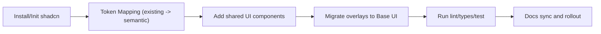
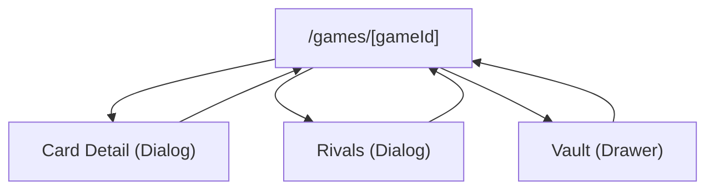

# feat: shadcn ui 도입 및 base ui headless 전환

## Enhancement Summary

**Deepened on:** 2026-02-13
**Sections enhanced:** 9
**Research agents used:** `architecture-strategist`, `security-sentinel`, `performance-oracle`, `kieran-typescript-reviewer`, `julik-frontend-races-reviewer`, `spec-flow-analyzer`, `best-practices-researcher`, `framework-docs-researcher`, `repo-research-analyst`, `learnings-researcher`, `frontend-design`

### Key Improvements

1. shadcn 초기화를 Base UI 템플릿 중심으로 고정하고(`--template base-ui`), `components.json`의 변경비용 큰 필드(`style`, `tailwind.baseColor`, `tailwind.cssVariables`)를 선결정 항목으로 승격.
2. Tailwind v4 monorepo 스캔 누락 방지를 위한 `@source` 명시 전략과 Next.js `transpilePackages` 설정을 계획에 포함.
3. Dialog/Drawer 접근성 수용 기준을 WAI-ARIA Authoring Practices(초기 포커스, Tab 순환, Escape 닫기, 트리거 복귀 포커스)로 명시.
4. Base UI 포털 레이어 권장값(`isolation: isolate`)과 iOS Safari backdrop 특이사항을 리스크/완화 항목으로 구체화.

### New Considerations Discovered

- `experimental.optimizePackageImports`는 실험 기능이므로 번들 분석 근거가 있을 때만 제한적으로 적용.
- Next.js 기본 최적화 대상에 `lucide-react`가 포함되어 있어 중복 최적화 설정이 불필요할 수 있음.
- Drawer는 `DrawerPreview`에서 정식 `Drawer`로 명칭/API가 진화 중이라, 앱 코드에는 어댑터 래퍼를 두는 편이 안전.
- `docs/solutions/patterns/critical-patterns.md` 기준으로 본 변경도 최소 `pnpm lint`, `pnpm check-types`, `pnpm test`를 필수 게이트로 유지.

## Section Manifest

Section 1: Overview + Problem Statement - 도입 목표/동기와 기존 UI 기술부채를 최신 공식 가이드 기준으로 정렬한다.
Section 2: External Research Summary - shadcn/Base UI/Next/Tailwind의 2026년 기준 설치 및 구성 규칙을 확정한다.
Section 3: Proposed Solution - 하이브리드 아키텍처(shadcn styling + Base UI headless)의 구체 구현 규칙을 명시한다.
Section 4: Implementation Phases - 단계별 검증 포인트와 회귀 방지 체크리스트를 강화한다.
Section 5: Acceptance Criteria - 기능/접근성/정책/성능 수용 기준을 측정 가능 항목으로 보강한다.
Section 6: Success Metrics - UI 품질/성능 신호를 운영 지표로 연결한다.
Section 7: Dependencies & Risks - 버전/API/브라우저/구성 충돌 리스크를 명확히 분류한다.
Section 8: Test Plan - 자동/수동 검증 시나리오를 접근성 회귀 중심으로 심화한다.
Section 9: References & Learnings - 외부 근거와 내부 학습을 연결해 재발 방지 규칙으로 반영한다.

## Overview

`apps/web`에 `shadcn/ui`를 도입하고, headless 상호작용 레이어는 `Base UI`로 통일한다.
기존 프로젝트에서 사용 중인 컬러 토큰(`apps/web/app/globals.css`)은 유지하고, shadcn의 semantic token으로 매핑한다.

핵심 목표:

- 스타일 시스템 표준화: shadcn 컴포넌트/토큰 체계 도입
- 상호작용 접근성 표준화: 수동 dialog 훅 대신 Base UI primitives 사용
- 디자인 정합성 유지: 기존 컬러 토큰을 우선 소스 오브 트루스로 계승

## Problem Statement / Motivation

현재 `apps/web`는 CSS Modules + 수동 접근성 훅 조합으로 동작하며, 공통 UI 체계가 약하다.

- UI 라이브러리 부재: `apps/web/package.json:16`에 `shadcn`, `tailwind`, `headless` 계열 의존이 없음.
- 컬러 토큰은 존재하나 컴포넌트 체계와 분리: `apps/web/app/globals.css:1`.
- 오버레이 접근성은 커스텀 훅으로 관리: `apps/web/src/presentation/game/useDialogAccessibility.ts:27`.
- 오버레이 구현이 분산: `apps/web/src/presentation/game/CardDetailModal.tsx:23`, `apps/web/src/presentation/game/RivalsOverlay.tsx:38`, `apps/web/src/presentation/game/VaultSheet.tsx:34`.
- 수동 접근성 훅 전용 테스트가 별도로 존재: `apps/web/tests/dialog-accessibility.spec.tsx:43`.

이 상태는 화면 수가 늘어날수록 컴포넌트 일관성, 접근성 품질, 재사용성이 동시에 저하될 위험이 있다.

## Idea Refinement Notes

- 최근 brainstorm(`docs/brainstorms/2026-02-12-solo-bot-hybrid-brainstorm.md`)은 봇/LLM 정책 주제로 본 작업과 무관.
- 사용자 요구가 이미 구체적(`shadcn 도입`, `headless는 base ui`, `컬러 토큰 계승`)이므로 추가 정제 질문 없이 계획 수립.

## Research Decision

외부 리서치를 수행한다.

- 이유 1: 사용자 요청에 공식 문서(`https://ui.shadcn.com/llms.txt`)가 명시됨.
- 이유 2: 현재 코드베이스에 shadcn/tailwind/headless 도입 이력이 없어 내부 패턴만으로는 불확실성이 큼.
- 이유 3: 새 라이브러리 도입은 설치/구성 규칙이 버전에 민감하므로 1차 문서 검증이 필요.

## Repository Research Summary

### Architecture/Boundary

- `apps/web`는 presentation 레이어이며 domain/infra 책임을 침범하면 안 됨 (`docs/concerns-and-boundaries.md`).
- UI 라이브러리 도입은 `apps/web`, `packages/ui` 범위에서 완료해야 하며 게임 룰/서버 계약은 변경하지 않는다.

### Current UI Stack

- 웹 런타임은 Next.js 16 + React 19 (`apps/web/package.json:19`).
- UI 스타일은 CSS Modules와 전역 CSS 변수 조합.
- `packages/ui`는 현재 템플릿 수준 컴포넌트만 존재 (`packages/ui/src/button.tsx:1`, `packages/ui/src/card.tsx:1`).

### Color Tokens (To Preserve)

기존 컬러 토큰(계승 대상):

- `--surface-0`, `--surface-1`, `--surface-2`
- `--ink-strong`, `--ink-on-dark`, `--ink-muted`
- `--border-soft`
- `--accent-ruby`, `--accent-sapphire`, `--accent-emerald`, `--accent-gold`
- `--card-bg`

출처: `apps/web/app/globals.css:1`

### Headless Surface (Migration Targets)

- Card Detail Modal: `apps/web/src/presentation/game/CardDetailModal.tsx:23`
- Rivals Overlay: `apps/web/src/presentation/game/RivalsOverlay.tsx:38`
- Vault Sheet: `apps/web/src/presentation/game/VaultSheet.tsx:34`
- 공통 접근성 훅: `apps/web/src/presentation/game/useDialogAccessibility.ts:27`

### Existing Decision Conflict to Update

기존 계획은 Tailwind 신규 도입 제외로 잠겨 있음:

- `docs/plans/2026-02-13-feat-web-reference-multiscreen-ui-plan.md:219`
- `docs/plans/2026-02-13-feat-web-reference-multiscreen-ui-plan.md:273`

이번 계획은 사용자 요구를 반영해 해당 잠금을 "Tailwind v4 + shadcn 도입"으로 대체한다.

## External Research Summary (Primary Sources)

### shadcn/ui

- `llms.txt` 기준: shadcn/ui는 TypeScript + Tailwind CSS + 구성형 컴포넌트 배포 플랫폼이며 설치/CLI/components.json/theming/monorepo 문서를 제공.
- Next 설치 플로우: `npx shadcn@latest init` 후 `npx shadcn@latest add button`.
- `components.json` 핵심:
  - `style`/`tailwind.baseColor`/`tailwind.cssVariables`는 초기화 후 변경 비용이 큼.
  - Tailwind v4에서는 `tailwind.config`를 비워두는 구성을 권장.
  - aliases와 tsconfig path를 맞춰야 CLI 설치 경로가 안정적.
- 모노레포 문서 핵심:
  - 워크스페이스별 `components.json` 필요.
  - app 경로에서 `add` 실행 시 CLI가 적절한 워크스페이스에 파일/의존 설치.
  - `style`, `iconLibrary`, `baseColor`를 워크스페이스 간 동일하게 유지 권장.
- 테마 문서 핵심:
  - CSS 변수 방식 권장(`tailwind.cssVariables: true`).
  - `:root`/`.dark`에서 변수 선언 후 `@theme inline`으로 Tailwind 토큰 노출 가능.

### Base UI

- `@base-ui/react` 단일 패키지, tree-shaking 지원.
- Quick start 권장사항:
  - 앱 루트에 `isolation: isolate` 추가(포털 레이어 충돌 방지).
  - iOS Safari 대응을 위해 backdrop 전략(`position: absolute` 케이스) 고려.
- Dialog/Drawer 컴포넌트는 unstyled primitive로 제공되어 CSS Modules 또는 Tailwind 어느 쪽에도 결합 가능.
- Drawer는 현재 `DrawerPreview` 네이밍(프리뷰 상태) 주의 필요.

### Additional 2026 Validation Notes

- shadcn 공식 changelog 기준으로 CLI 템플릿에 Base UI가 포함되어, 초기화 시 `--template base-ui` 선택이 가능하다.
- shadcn `components.json` 문서에서 `style`, `tailwind.baseColor`, `tailwind.cssVariables`는 초기화 이후 변경 비용이 매우 큰 항목으로 분류된다.
- Tailwind CSS v4 모노레포에서는 `packages/ui` 경로가 자동 탐지되지 않으면 `@source`를 통해 명시 등록해야 클래스 누락을 줄일 수 있다.
- Next.js(16 문서 기준) 모노레포 패키지는 `transpilePackages`를 통해 명시 번들링하는 구성이 기본 권장 패턴이다.

## Assumptions / Open Questions

결정이 필요하지만 현재 정보로 기본 가정을 둔다.

1. Tailwind 범위
- 가정: 1차는 `apps/web` + `packages/ui`만 Tailwind v4 도입.

2. Headless 기준
- 가정: overlay/dialog/drawer 계열은 Base UI로 통일하고 Radix/Headless UI 신규 도입 금지.

3. 화면 전면 교체 여부
- 가정: 전 화면 일괄 교체가 아니라 공통 컴포넌트와 overlay 우선 전환(점진 적용).

4. 다크모드
- 가정: 1차는 기존 라이트 기반 토큰 유지, 다크 토큰은 최소 스켈레톤만 확보.

## SpecFlow Analysis

### Primary Flow



### User-Visible Interaction Flow



### Gaps / Edge Cases

- 기존 수동 focus trap 동작(`Tab` 순환, `Escape` 닫기, focus 복귀)과 Base UI 기본 동작 간 차이.
- `inert`/`aria-hidden` 처리 주체가 훅에서 라이브러리로 이동하면서 테스트 실패 가능.
- iOS Safari에서 backdrop/viewports 처리 회귀 가능.
- monorepo alias 오설정 시 CLI가 컴포넌트를 잘못된 패키지에 생성할 위험.
- 기존 Tailwind 제외 정책과 충돌하므로 문서/팀 합의 갱신 필요.

## Proposed Solution

### 1. Adoption Strategy

선택안: `shadcn(스타일/컴포넌트 분배) + Base UI(headless primitive)` 하이브리드.

- shadcn: Button/Input/Card/Tabs 등 스타일 일관성 확보.
- Base UI: Dialog/Drawer/Popover 등 접근성 핵심 primitive.
- 기존 컬러 토큰: 삭제하지 않고 semantic 토큰 계층으로 매핑.

### 2. Directory & Ownership

- `packages/ui`를 공용 UI 소스 오브 트루스로 승격.
- `apps/web`는 페이지 조합과 feature-level 컴포넌트만 유지.
- `apps/web`에서 직접 base primitive를 만들지 않고 `@repo/ui`를 통해 사용.

### 3. Token Inheritance Plan

파일: `packages/ui/src/styles.css` (신규, pseudo)

```css
:root {
  /* existing project tokens (source-of-truth) */
  --surface-0: #0d121b;
  --ink-strong: #0f1824;
  --accent-sapphire: #2563eb;

  /* shadcn semantic bridge */
  --background: var(--card-bg);
  --foreground: var(--ink-strong);
  --primary: var(--accent-sapphire);
  --border: var(--border-soft);
  --radius: 0.625rem;
}

@theme inline {
  --color-background: var(--background);
  --color-foreground: var(--foreground);
  --color-primary: var(--primary);
  --color-border: var(--border);
}
```

### 4. Headless Migration Matrix

- `CardDetailModal` -> `Base UI Dialog`
- `RivalsOverlay` -> `Base UI Dialog`
- `VaultSheet` -> `Base UI DrawerPreview`
- `useDialogAccessibility` 훅 -> 제거(또는 fallback 전용 축소)
- `dialog-accessibility.spec.tsx` -> Base UI 기반 접근성 회귀 테스트로 개편

### 5. Guardrails

- ESLint `no-restricted-imports` 규칙으로 `@headlessui/*` 신규 import 금지.
- 동일 규칙으로 `@radix-ui/*` import를 금지(이번 계획의 headless 정책 일치).
- `packages/ui` 외 경로에서 UI primitive 직접 구현 금지(컴포넌트 중복 방지).

### Research Insights

**Best Practices:**

- shadcn 설치는 `pnpm dlx shadcn@latest init --template base-ui`를 기준으로 하고, `components.json`의 불변성 높은 필드(`style`, `baseColor`, `cssVariables`)를 초기 PR에서 확정한다.
- Base UI overlay primitive는 앱 전역 포털 레이어와 충돌 방지를 위해 `:root` 또는 앱 최상위 컨테이너에 `isolation: isolate`를 적용한다.
- 접근성 동작은 라이브러리 기본동작을 신뢰하되, 수용 기준은 WAI-ARIA Dialog 패턴으로 고정한다(초기 포커스, Tab/Shift+Tab 순환, Escape 닫기, 트리거 포커스 복귀).

**Performance Considerations:**

- `@repo/ui`는 `transpilePackages`에 명시해 dev/prod 빌드 편차를 줄인다.
- `experimental.optimizePackageImports`는 실험 옵션이므로 번들 분석에서 효과가 확인된 라이브러리만 한정 적용한다.
- Tailwind v4에서 모노레포 클래스 스캔이 누락되지 않도록 `@source`를 명시한다.

**Implementation Details:**

```ts
// apps/web/next.config.ts (example)
import type { NextConfig } from "next";

const nextConfig: NextConfig = {
  transpilePackages: ["@repo/ui"],
  experimental: {
    // Enable only after verifying real bundle wins.
    optimizePackageImports: ["@base-ui/react"],
  },
};

export default nextConfig;
```

```css
/* apps/web/app/globals.css (Tailwind v4 monorepo source registration example) */
@import "tailwindcss";
@source "../../../packages/ui/src/**/*.{ts,tsx}";

/* Base UI portal stacking isolation */
#__next {
  isolation: isolate;
}
```

**Edge Cases:**

- `open` 상태 변경과 라우트 전환이 겹칠 때 focus restore 타깃이 unmount될 수 있어, fallback focus 노드를 명시한다.
- 중첩 overlay(예: dialog 위 tooltip/popover)에서 scroll lock이 중복 적용될 수 있어 단일 책임 컨테이너를 유지한다.
- iOS Safari에서 주소창 접힘/펼침 시 viewport와 backdrop 높이 어긋남이 발생할 수 있어 실기기 검증을 필수화한다.

## Alternative Approaches Considered

1. 기존 CSS Modules + 수동 훅 유지
- 장점: 변경량 최소
- 단점: 컴포넌트 일관성과 접근성 유지비용이 계속 증가

2. shadcn 기본(Radix) 그대로 도입
- 장점: shadcn 생태계와 가장 단순한 결합
- 단점: 사용자 요구("headless는 Base UI") 불충족

3. Base UI만 단독 도입
- 장점: headless 일관성 확보
- 단점: shadcn의 분배/스타일링 생산성 이점을 잃음

선택: 2개 조합(선택안 3이 아님)으로 요구사항 충족 + 유지보수성 균형.

## Implementation Phases

### Phase 1: Foundation (Monorepo + Tooling)

- [x] `apps/web`에 Tailwind v4 및 shadcn CLI 전제 의존 설치
- [x] `apps/web/components.json`, `packages/ui/components.json` 생성
- [ ] aliases/tsconfig path 정합성 맞춤
- [x] `packages/ui/src/styles.css` 생성 및 앱 엔트리에 연결

파일 목록(예정):

- `apps/web/package.json`
- `apps/web/components.json`
- `packages/ui/package.json`
- `packages/ui/components.json`
- `packages/ui/src/styles.css`
- `apps/web/app/layout.tsx`

### Phase 2: shadcn Base Component Layer

- [x] shadcn 스타일 레이어로 `button`, `input`, `card`, `badge`, `tabs` 우선 도입
- [x] `@repo/ui` export surface 정리
- [ ] 로그인/로비 등 공통 버튼/입력 컴포넌트부터 교체

파일 목록(예정):

- `packages/ui/src/components/ui/button.tsx`
- `packages/ui/src/components/ui/input.tsx`
- `packages/ui/src/components/ui/card.tsx`
- `packages/ui/src/components/ui/tabs.tsx`
- `packages/ui/src/index.ts`

### Phase 3: Base UI Headless Migration

- [x] Base UI 의존 설치(`@base-ui/react`)
- [x] `CardDetailModal`/`RivalsOverlay`를 `Dialog`로 전환
- [x] `VaultSheet`를 `DrawerPreview`로 전환
- [x] `useDialogAccessibility` 훅 제거 또는 레거시 fallback으로 축소

파일 목록(예정):

- `apps/web/src/presentation/game/CardDetailModal.tsx`
- `apps/web/src/presentation/game/RivalsOverlay.tsx`
- `apps/web/src/presentation/game/VaultSheet.tsx`
- `apps/web/src/presentation/game/useDialogAccessibility.ts`

### Phase 4: Regression & Hardening

- [x] 접근성 회귀 테스트 업데이트 (focus trap, ESC, 복귀 포커스)
- [ ] 모바일 뷰포트(360px) 및 iOS backdrop 동작 수동 확인
- [ ] style/token drift 점검(기존 컬러 토큰 유지 여부)

파일 목록(예정):

- `apps/web/tests/dialog-accessibility.spec.tsx`
- `apps/web/tests/page-style-guard.spec.ts`
- `apps/web/tests/routes.spec.ts`

### Phase 5: Docs & Rollout

- [ ] 기존 "Tailwind 제외" 잠금 문서 업데이트
- [x] README/UI 기술스택 섹션 반영
- [ ] 아키텍처 문서에서 UI 라이브러리 경계(`packages/ui` 책임) 명시 강화

파일 목록(예정):

- `docs/plans/2026-02-13-feat-web-reference-multiscreen-ui-plan.md`
- `README.md`
- `ARCHITECTURE.md`
- `docs/concerns-and-boundaries.md`

### Phase-level Research Insights

**Phase 1 (Foundation):**

- `components.json`은 `apps/web`, `packages/ui` 각각 독립 관리하되 `style`, `baseColor`, `iconLibrary`를 동일하게 맞춘다.
- `tsconfig` alias와 `components.json.aliases`를 동기화하지 않으면 CLI 파일 생성 경로가 흔들리므로 CI에서 JSON 스키마 체크를 추가한다.

**Phase 2 (Base Component Layer):**

- shadcn 생성 컴포넌트는 그대로 확장하지 말고 `@repo/ui` 내 래퍼를 둬 토큰/variant 정책을 강제한다.
- 동적 문자열로 Tailwind class를 조합하면 스캔 누락 위험이 있으므로 variant map(정적 문자열) 패턴을 사용한다.

**Phase 3 (Headless Migration):**

- Dialog/Drawer 교체 시 기존 `useDialogAccessibility`의 책임(escape 핸들링, focus restore)을 테스트로 먼저 고정한 뒤 구현을 교체한다.
- Drawer API 변동 가능성에 대비해 `AppDrawer` 어댑터 컴포넌트를 도입해 Base UI 변경을 국소화한다.

**Phase 4 (Regression/Hardening):**

- 접근성 회귀는 키보드 시나리오를 우선 자동화(`Tab`, `Shift+Tab`, `Escape`, reopen focus)하고, 모바일/iOS는 수동 시나리오로 보강한다.
- 스타일 드리프트는 "hex 직접 사용 0건"과 "semantic token only" 규칙을 lint 커스텀 룰 또는 grep 체크로 운영한다.

**Phase 5 (Docs/Rollout):**

- 기존 Tailwind 제외 문서를 갱신할 때 "왜 변경했는지(사용자 요구 + 2026 공식 문서 근거)"를 함께 남겨 의사결정 추적성을 확보한다.
- README에는 도입 기술만 나열하지 말고, "shadcn=styled layer, Base UI=headless layer" 책임 분리를 명시한다.

## Acceptance Criteria

- [ ] `shadcn` CLI 기반 컴포넌트 추가가 monorepo에서 정상 동작한다.
- [x] 기존 컬러 토큰(`apps/web/app/globals.css`)이 제거되지 않고 semantic token으로 매핑된다.
- [x] overlay 3종(카드 상세/상대 현황/금고 시트)이 Base UI 기반으로 동작한다.
- [x] `@headlessui/*` 및 `@radix-ui/*` 신규 import가 lint 규칙으로 차단된다.
- [x] `pnpm lint`, `pnpm check-types`, `pnpm test`를 통과한다.

### Research Insights

- 접근성 수용 기준을 테스트 명세로 구체화한다:
  - Dialog open 직후 포커스가 의미 있는 첫 요소로 이동
  - `Tab`/`Shift+Tab`가 overlay 내부에서 순환
  - `Escape`로 닫히고, 닫힌 뒤 트리거로 포커스 복귀
- 성능 기준을 최소값으로 추가한다:
  - `/games/[gameId]` 상호작용의 p75 INP 200ms 이하 목표(Web Vitals "good" 기준)
  - 신규 UI 도입 후 번들 증가량이 허용 임계(예: +30KB gzip) 이내인지 확인
- 정책 기준을 추가한다:
  - 신규 overlay 구현 파일에서 `@base-ui/react` 직접 import 허용 범위를 `@repo/ui` 내부로 제한

## Success Metrics

- UI 중복 구현 감소: 공통 버튼/입력/카드 직접 구현 코드 30% 이상 축소.
- 접근성 회귀 0건: dialog/drawer 관련 테스트 실패 0건 유지.
- 색상 일관성: 신규 shadcn 컴포넌트에서 하드코딩 hex 사용 0건(토큰 사용).
- 상호작용 응답성: `/games/[gameId]` p75 INP <= 200ms.

## Dependencies & Risks

### Dependencies

- Tailwind v4 + shadcn CLI + Base UI 버전 조합 호환성
- `packages/ui` export 구조 정비
- 문서 동기화(기존 Tailwind 제외 결정 업데이트)

### Risks

- 토큰 브릿지 설계 실패 시 기존 화면 색감 이탈
- DrawerPreview API 변경(프리뷰 상태)으로 인한 추후 리팩터링 비용
- monorepo alias 오설정으로 CLI 설치 경로 혼선

### Mitigation

- Phase 1에서 토큰 매핑 스냅샷 테스트/시각 비교 수행
- Drawer 사용부를 어댑터 컴포넌트로 감싸 API 변경 범위 축소
- components.json + tsconfig path를 CI 체크 항목에 포함

### Research Insights

**Additional Risks:**

- Tailwind v4 도입 초기에 `@source` 누락 시 `packages/ui` class가 일부 환경에서 빌드 누락될 수 있다.
- `experimental.optimizePackageImports`는 안정 API가 아니므로 Next minor 업데이트에서 동작 변화 가능성이 있다.
- Base UI overlay와 기존 CSS `z-index` 계층이 충돌하면 클릭 불가/포커스 고립 이슈가 발생할 수 있다.

**Mitigation Additions:**

- `@source` 누락 여부를 CI에서 정적 검사(예: `rg \"@source .*packages/ui\" apps/web/app/globals.css`)로 검증한다.
- 실험 기능은 feature flag로 감싸고 default off 상태에서 번들 분석 후 활성화한다.
- overlay z-index/focus 레이어를 Storybook 또는 visual regression 시나리오로 고정해 회귀를 조기 감지한다.

## Test Plan

### Automated

```bash
pnpm lint
pnpm check-types
pnpm test
```

릴리즈 직전 또는 대규모 치환 시:

```bash
pnpm test:coverage
```

### Manual

- [ ] `/games/[gameId]`에서 Card Detail 열기/닫기 + ESC + 포커스 복귀 확인
- [ ] `/games/[gameId]`에서 Rivals Overlay 열기/닫기 + 키보드 Tab 순환 확인
- [ ] `/games/[gameId]`에서 Vault Sheet 스와이프/닫기(모바일) 확인
- [ ] 기존 화면 색상(버튼/배경/텍스트)이 이전 토큰 팔레트와 시각적으로 연속성 유지 확인

### Research Insights

**Automated Additions:**

- `dialog-accessibility.spec.tsx`에 "open trigger unmount 후 close" 케이스를 추가해 focus restore fallback을 검증한다.
- `page-style-guard.spec.ts`에 semantic token 사용 강제(예: `var(--background)`, `var(--foreground)`) 회귀 검사를 추가한다.
- 번들 분석 스크립트(예: `next build --analyze`)를 CI 선택 단계로 추가해 라이브러리 도입 후 크기 변화를 추적한다.

**Manual Additions:**

- iOS Safari 실기기에서 Drawer 열림 상태로 주소창 show/hide 시 backdrop, body scroll lock, 포커스 가능 요소 노출 여부 확인.
- 키보드 전용 사용 시 overlay 내부에서 "시각적 포커스 링"이 명확히 보이는지 확인.
- 스크린리더(VoiceOver/NVDA)에서 Dialog 제목/설명이 올바르게 읽히는지 확인.

## Applied Learnings (docs/solutions)

- `docs/solutions/patterns/critical-patterns.md`
  - 적용: 본 작업도 "부분 완료 금지" 원칙을 적용해 최소 품질 게이트(`pnpm lint`, `pnpm check-types`, `pnpm test`)를 완료 기준으로 유지.
  - 반영 위치: `Acceptance Criteria`, `Test Plan`.
- `docs/solutions/integration-issues/local-inmemory-runtime-integration-game-server-web-20260213.md`
  - 판정: 직접 적용성은 낮음(로컬 런타임 통합 중심), 다만 "수동 스모크 절차 표준화" 원칙을 수동 검증 체크리스트 강화에 간접 반영.
- `docs/solutions/workflow-issues/contract-drift-shared-types-20260213.md`
  - 판정: 직접 적용성 낮음(shared-types 계약 진화 중심 도메인).
- `docs/solutions/workflow-issues/scenario-expected-outcome-contract-sync-20260213.md`
  - 판정: 직접 적용성 낮음(test-fixtures 계약 동기화 중심), "기대 결과를 계약으로 고정" 관점만 접근성 테스트 명세에 간접 반영.
- `docs/solutions/logic-errors/invalid-score-map-and-unnecessary-token-return-rule-engine-20260213.md`
  - 판정: 비적용(rule-engine 정책 검증 도메인).

## References & Research

### Internal

- `apps/web/app/globals.css:1`
- `apps/web/package.json:16`
- `apps/web/src/presentation/game/useDialogAccessibility.ts:27`
- `apps/web/src/presentation/game/CardDetailModal.tsx:23`
- `apps/web/src/presentation/game/RivalsOverlay.tsx:38`
- `apps/web/src/presentation/game/VaultSheet.tsx:34`
- `apps/web/tests/dialog-accessibility.spec.tsx:43`
- `docs/plans/2026-02-13-feat-web-reference-multiscreen-ui-plan.md:219`
- `docs/plans/2026-02-13-feat-web-reference-multiscreen-ui-plan.md:273`

### External

- shadcn LLM index: https://ui.shadcn.com/llms.txt
- shadcn Changelog (`--template base-ui`): https://ui.shadcn.com/docs/changelog
- shadcn Next 설치: https://ui.shadcn.com/docs/installation/next
- shadcn `components.json`: https://ui.shadcn.com/docs/components-json
- shadcn Theming: https://ui.shadcn.com/docs/theming
- shadcn Monorepo: https://ui.shadcn.com/docs/monorepo
- shadcn Tailwind v4: https://ui.shadcn.com/docs/tailwind-v4
- Base UI llms: https://base-ui.com/llms.txt
- Base UI Quick start: https://base-ui.com/react/overview/quick-start
- Base UI Dialog: https://base-ui.com/react/components/dialog
- Base UI Drawer Preview: https://base-ui.com/react/components/drawer-preview
- Next.js Package Bundling: https://nextjs.org/docs/app/guides/package-bundling
- Next.js `transpilePackages`: https://nextjs.org/docs/app/api-reference/config/next-config-js/transpilePackages
- Next.js `optimizePackageImports`: https://nextjs.org/docs/app/api-reference/config/next-config-js/optimizePackageImports
- Tailwind `@source` (monorepo scan): https://tailwindcss.com/docs/detecting-classes-in-source-files#explicitly-registering-sources
- WAI-ARIA Dialog Pattern: https://www.w3.org/WAI/ARIA/apg/patterns/dialog-modal/
- Web Vitals thresholds: https://web.dev/articles/vitals
- INP metric details: https://web.dev/articles/inp
