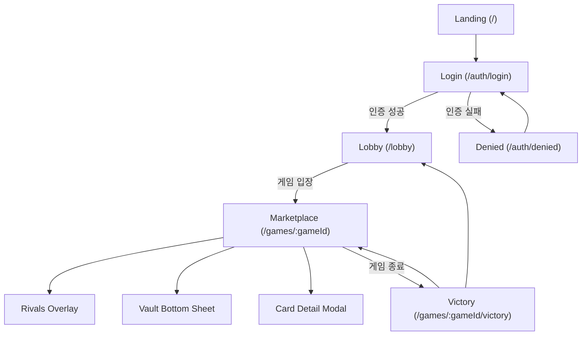

# feat: /web/reference 기반 멀티스크린 UI 구현

## Enhancement Summary

**Deepened on:** 2026-02-13  
**Sections enhanced:** 8  
**Research agents/skills used:** `frontend-design`, `architecture-strategist`, `security-sentinel`, `performance-oracle`, `julik-frontend-races-reviewer`, `kieran-typescript-reviewer`, `best-practices-researcher`, `framework-docs-researcher`, `repo-research-analyst`, `learnings-researcher`, `spec-flow-analyzer`

### Key Improvements

1. Next.js 16 App Router 규칙(동적 세그먼트 `params` Promise, `generateMetadata`, route-group root layout caveat)을 구현 계획에 명시.
2. 오버레이(UI 모달/시트)의 접근성 기준(`role="dialog"`, `aria-modal`, 초기 포커스, Escape 닫기, 배경 inert 처리)과 레이스 방지(cleanup) 규칙 추가.
3. 성능 운영 기준(INP <= 200ms, reduced-motion 대응, 동적 라우트 prefetch/로딩 상태)을 비기능 요구사항과 테스트로 연결.
4. 테스트 전략을 단위/통합/E2E로 계층화하고 Next.js 문서의 `async Server Components` 테스트 제약을 반영.

### New Considerations Discovered

- route group 간 다른 root layout 이동은 full page load가 발생할 수 있어, 상태 유지 요구와 충돌 가능.
- 타이머/소켓/이벤트 cleanup 누락 시 오버레이 열림/닫힘 반복에서 레이스 컨디션이 발생하기 쉬움.
- 동적 라우트 환경에서는 느린 네트워크 시 prefetch 체감이 떨어질 수 있어 skeleton/loading 플랜이 필요.

### Section Manifest

1. `Overview/Problem`: 목표를 화면 구현 + 런타임 안정성 + 접근성/성능 기준으로 확장 연구
2. `Research Decision`: 초기 내부 중심 판단 대비, 심화 단계 외부 공식 문서 보강
3. `Technical Approach`: App Router/A11y/상태관리/성능 관점의 구현 상세 보강
4. `Implementation Phases`: 각 Phase별 quality gate 및 실패 방지 장치 추가
5. `Acceptance Criteria`: 측정 가능한 품질 기준(INP, a11y, 복구성) 추가
6. `Test Plan`: unit/integration/E2E 분리 및 Next.js 제약 반영
7. `Dependencies & Risks`: route-group, hydration, race, 접근성 회귀 리스크 추가
8. `References`: 공식 문서/표준 링크 추가

## Overview

`apps/web/reference`에 정의된 9개 화면 레퍼런스를 Next.js 앱 라우트/컴포넌트로 구현한다.
핵심 목표는 다음 2가지다.

- 화면 품질: 레퍼런스 시각 구조(레이아웃/계층/상호작용 상태)를 모바일 우선으로 재현
- 아키텍처 준수: `apps/web`는 presentation 계층으로 유지하고 서버 권위 경계를 침범하지 않음

## Problem Statement / Motivation

현재 웹 앱은 로컬 런타임 검증용 단일 화면(`apps/web/app/page.tsx`)만 제공한다.
즉, 제품 관점의 유저 플로우(랜딩 → 로그인 → 로비 → 게임 → 승리)를 검증할 수 없다.

- 현재 메인 화면은 진단 UI 성격이다 (`apps/web/app/page.tsx:273`, `apps/web/app/page.tsx:325`).
- 앱 메타데이터도 템플릿 기본값 상태다 (`apps/web/app/layout.tsx:15`).
- 레퍼런스 화면은 별도 HTML로만 존재하고 실제 라우트에는 연결되어 있지 않다 (`apps/web/reference/**/code.html`).

## Idea Refinement Notes

- 최근 brainstorm 확인 결과, `docs/brainstorms/2026-02-12-solo-bot-hybrid-brainstorm.md` 1건만 존재.
- 해당 문서는 봇/LLM 의사결정 주제이며 본 작업(화면 구현)과 직접 연관되지 않아 입력에서 제외.
- 사용자 요청은 `/web/reference` 기반 화면 구현으로 명확하므로, 추가 질문 없이 계획 수립 진행.

## Research Decision

초기 계획 수립 단계에서는 외부 리서치를 생략했다.
본 심화 단계(2026-02-13)에서는 구현 리스크를 줄이기 위해 공식 문서/표준 기반 보강 리서치를 추가 수행했다.

- 고위험 도메인(결제/보안/개인정보) 변경이 아니다.
- 레포 내부 문서/코드/레퍼런스 HTML만으로 구현 범위와 제약이 충분히 확정된다.
- 다만 App Router/A11y/Web API 같이 버전·표준 민감 영역은 외부 1차 문서로 검증한다.

### Research Insights

**Best Practices:**
- 초기 계획 단계에서는 내부 컨텍스트 우선 접근이 타당하지만, UI 구현 계획 심화 시점에는 프레임워크 공식 문서와 접근성 표준을 보강하는 방식이 안전하다.
- Next.js App Router의 버전별 동작 차이(예: `params` Promise)처럼 시간에 따라 바뀌는 규칙은 문서 기반으로 재검증해야 한다.

**Performance Considerations:**
- 라우팅/오버레이 상호작용의 체감 지표를 사전에 정의하지 않으면 구현 후 품질 판단이 주관적으로 흐를 수 있다.
- 상호작용 중심 화면에서는 INP를 핵심 지표로 삼아 조기 측정 계획을 두는 것이 효과적이다.

**Implementation Details:**
```ts
// planning-level guardrail (pseudo)
const deepeningPolicy = {
  primary: "repo-local architecture + conventions",
  mandatoryExternal: ["nextjs.org docs", "react.dev docs", "w3.org aria pattern", "mdn web api"],
  validateVersion: true,
};
```

**Edge Cases:**
- 문서 미확인 상태에서 App Router 구버전 가정으로 구현하면 `params` 접근 방식이 어긋날 수 있다.
- 접근성 표준 미반영 시 기능은 동작해도 QA 후반에서 구조적 재작업이 발생한다.

**References:**
- [Next.js `layout` file convention](https://nextjs.org/docs/app/api-reference/file-conventions/layout)
- [Next.js `generateMetadata`](https://nextjs.org/docs/app/api-reference/functions/generate-metadata)
- [Web.dev INP](https://web.dev/inp/)

## Repository Research Summary

### Architecture & Structure

- 클라이언트는 상태를 직접 수정하지 않고 Command만 전송한다 (`AGENTS.md:31`).
- 룰 엔진은 순수 함수이며 UI에서 도메인 판정을 재구현하면 안 된다 (`ARCHITECTURE.md:24`, `docs/concerns-and-boundaries.md:78`).
- 레이어 의존성은 `presentation -> application -> domain -> types`를 따른다 (`docs/concerns-and-boundaries.md:53`).

### Current Web Snapshot

- 구현된 페이지는 `app/page.tsx` 1개이며 로컬 서버 연결/커맨드 전송 UI 중심이다 (`apps/web/app/page.tsx:273`).
- 전역 스타일은 템플릿 기본 다크/라이트 전환 중심으로 단순하다 (`apps/web/app/globals.css:1`).
- 스타일 가드 테스트가 존재하며 CSS Module 전역 `button` selector 금지를 강제한다 (`apps/web/tests/page-style-guard.spec.ts:9`).

### Reference Asset Inventory

다음 9개 레퍼런스가 구현 대상이다.

- 랜딩: `apps/web/reference/modern_merchant_landing_page/code.html:6`
- 로그인: `apps/web/reference/merchant_login_access/code.html:6`
- 인증 실패: `apps/web/reference/login_failure_denied_access/code.html:6`
- 로비: `apps/web/reference/lobby_/_dashboard/code.html:6`
- 메인 보드: `apps/web/reference/the_marketplace_(main_game_board)/code.html:6`
- 내 자원 시트(Vault): `apps/web/reference/the_vault_(player_resources)/code.html:6`
- 상대 HUD(Rivals): `apps/web/reference/rivals_(opponent_hud_-_expanded)/code.html:6`
- 카드 상세 오버레이: `apps/web/reference/card_detail_overlay/code.html:6`
- 승리 화면: `apps/web/reference/victory/code.html:6`

### Documentation Insights

- 의미 있는 변경 후 필수 검증은 `pnpm lint`, `pnpm check-types`, `pnpm test`다 (`AGENTS.md:48`).
- UI 변경도 통합 런타임 흐름을 깨지 않도록 스모크 절차 유지가 권장된다 (`docs/solutions/patterns/critical-patterns.md:5`).

### Templates Found

- `.github/ISSUE_TEMPLATE`는 현재 레포에 없다.
- 계획 문서는 `docs/plans/` + frontmatter 패턴을 사용한다.

## Institutional Learnings Search Results

### Search Context

- Feature/Task: `/web/reference` 기반 다중 화면 UI 구현 및 기존 로컬 런타임 UI 정리
- Keywords Used: `web`, `ui`, `local-runtime`, `integration`, `screen`, `layout`
- Files Scanned: 4 (`critical-patterns` 포함)
- Relevant Matches: 2

### Critical Patterns (Always Check)

- Local Runtime Vertical Slice Completion: UI를 바꾸더라도 `lint/typecheck/test` + 스모크 검증 절차를 유지해야 한다 (`docs/solutions/patterns/critical-patterns.md:5`).

### Relevant Learnings

#### 1) Local InMemory Runtime Integration
- File: `docs/solutions/integration-issues/local-inmemory-runtime-integration-game-server-web-20260213.md`
- Relevance: 기존 `apps/web`는 로컬 서버와 연결되는 플레이 가능 루프를 이미 확보했다.
- Key Insight: 새 UI 도입 시에도 `게임 생성/구독/커맨드` 경로를 유지해야 런타임 회귀를 막을 수 있다 (`docs/solutions/integration-issues/local-inmemory-runtime-integration-game-server-web-20260213.md:56`).

#### 2) Contract Drift Shared-types
- File: `docs/solutions/workflow-issues/contract-drift-shared-types-20260213.md`
- Relevance: 화면 구현 과정에서 임의 프론트 타입을 만들면 계약 드리프트 위험이 생긴다.
- Key Insight: `@repo/shared-types`를 단일 진실원으로 유지하고, 화면 표시용 계산만 presentation에서 수행한다.

### Recommendations

- 기존 로컬 런타임 진입점은 삭제하지 말고 `dev` 전용 라우트로 이동해 디버깅 가치를 보존.
- 레퍼런스 복제보다 컴포넌트 단위로 분해해 재사용(보드/오버레이/HUD) 우선.
- 화면 단위 구현 후 매 단계에서 타입/테스트 게이트를 통과시키는 수직 슬라이스 방식 채택.

## SpecFlow Analysis

### User Flow Overview



### Flow Permutations Matrix

| 축 | 케이스 | 기대 동작 |
| --- | --- | --- |
| 인증 | 성공 | 로비로 이동, 유저 식별자 보존 |
| 인증 | 실패 | denied 화면 표시 후 재인증 동선 제공 |
| 로비 탭 | your turn / waiting / completed | 탭 상태 변경 시 목록 필터 반영 |
| 게임 화면 | 기본 | 마켓+토큰바 렌더, 현재 턴/점수 표시 |
| 게임 화면 | 오버레이 열림 | Rivals/Vault/CardDetail 각각 포커스 트랩/닫기 동작 보장 |
| 반응형 | 모바일(우선) | 360~430px 폭에서 레이아웃 깨짐 없음 |
| 반응형 | 데스크톱 | 가운데 컨테이너 + 최대폭 제한 유지 |
| 런타임 | 서버 지연/오류 | 오류 배너/재시도 UI 노출 |
| 런타임 | WS 재연결 | 최신 스냅샷 재표시, 중복 렌더/크래시 없음 |

### Missing Elements & Gaps

아래 핵심 공백은 본 계획의 `Decision Locks`와 `Implementation Phases`에서 확정했다.

1. 라우트 설계
- 상태: 확정 (`/`, `/auth/login`, `/auth/denied`, `/lobby`, `/games/[gameId]`, `/games/[gameId]/victory`, `/dev/local-runtime`)
- 근거: `Decision Locks` Lock 1, Lock 2

2. 기존 로컬 런타임 화면 처리
- 상태: 확정 (`/dev/local-runtime` 유지)
- 근거: `Decision Locks` Lock 2, `Phase 4`

3. 오버레이 상태 소유권
- 상태: 확정 (1차는 local UI state, URL deep-link는 2차)
- 근거: `Decision Locks` Lock 3

4. 스타일 통합 전략
- 상태: 확정 (CSS Modules + 글로벌 토큰, Tailwind 신규 도입 제외)
- 근거: `Decision Locks` Lock 4

5. 테스트 범위
- 상태: 확정 (화면별 자동화 테스트 + 런타임/접근성/E2E 계층)
- 근거: `Test Plan`, `Phase 5`

### Critical Questions Requiring Clarification

1. Critical
- 질문: 레퍼런스 9개를 한 번에 모두 구현할지, 1차 범위를 `landing/login/lobby/marketplace`로 제한할지?
- 왜 중요: 일정과 PR 크기를 결정한다.
- 미응답 기본 가정: 9개 전부 구현하되, 게임 오버레이는 1차에서 정적/더미 데이터 허용.

2. Important
- 질문: 기존 로컬 런타임 UI를 `/dev/local-runtime`으로 유지해도 되는지?
- 왜 중요: 운영용 화면과 디버그 화면 충돌을 방지한다.
- 미응답 기본 가정: 유지한다.

3. Important
- 질문: 인증은 실제 백엔드 연동 없이 로컬 mock 단계로 진행할지?
- 왜 중요: 로그인/실패 화면의 완료 정의가 달라진다.
- 미응답 기본 가정: mock 인증으로 우선 연결하고 추후 서버 연동.

### Research Insights

**Best Practices:**
- 플로우 명세에는 “정상 경로”뿐 아니라 “복귀 경로”(재시도, 재연결, 뒤로가기)와 “중단 경로”(페이지 이탈, 탭 비활성화)를 동급으로 포함해야 한다.
- 인증 실패 플로우는 구체 원인 노출 대신 재시도 액션 중심으로 설계해 보안/UX 균형을 맞춘다.

**Performance Considerations:**
- 게임 화면의 체감 성능은 단일 렌더 시간보다 “연속 상호작용 품질”이 중요하므로 overlay toggle, tab 전환, socket 갱신 상황을 별도 계측한다.

**Implementation Details:**
```md
SpecFlow 추가 체크리스트
1) pagehide -> pageshow 시 websocket 재연결/동기화
2) overlay open 상태에서 route transition
3) 인증 실패 후 재로그인 성공 시 상태 초기화
```

**Edge Cases:**
- 모바일 브라우저에서 앱 전환 후 복귀 시 소켓이 종료된 채 UI가 연결된 것처럼 보이는 상태 불일치.
- denied 화면에서 브라우저 뒤로가기로 로그인 화면이 아닌 이전 보호 페이지가 보이는 우회 동선.

**References:**
- [MDN WebSocket lifecycle in pagehide/pageshow](https://developer.mozilla.org/en-US/docs/Web/API/WebSockets_API/Writing_WebSocket_client_applications)
- [WAI-ARIA Authoring Practices](https://www.w3.org/WAI/ARIA/apg/)

## Decision Locks (Default)

- Lock 1: 라우트 분리로 구현한다 (`/`, `/auth/login`, `/auth/denied`, `/lobby`, `/games/[gameId]`, `/games/[gameId]/victory`).
- Lock 2: 기존 `Merchant Local Runtime` 화면은 `/dev/local-runtime`으로 이동해 유지한다.
- Lock 3: 오버레이 상태는 1차에서 local UI state로 관리하고, URL deep-link는 2차 개선으로 미룬다.
- Lock 4: 스타일은 CSS Modules + 전역 토큰(`app/globals.css`) 기반으로 구현한다. (Tailwind 신규 도입은 범위 밖)
- Lock 5: 게임 데이터는 기존 `src/lib/game-client.ts`를 재사용하며, 도메인 판정 로직은 추가하지 않는다.
- Lock 6: `gameId` 진입 계약을 명시한다. 로비에서 `createGame/getGame` 성공 후에만 `/games/[gameId]`로 이동한다.
- Lock 7: 로컬 mock 인증은 `NODE_ENV=development`에서만 허용하고, production 빌드에서는 강제 비활성화한다.
- Lock 8: 오버레이 접근성은 선언만이 아니라 포커스 트랩/복귀, 배경 inert 처리까지 구현 완료 조건으로 잠근다.

## Technical Approach

### Route & Screen Mapping

| Route | Reference Source | Primary File (예정) |
| --- | --- | --- |
| `/` | `modern_merchant_landing_page` | `apps/web/app/page.tsx` |
| `/auth/login` | `merchant_login_access` | `apps/web/app/auth/login/page.tsx` |
| `/auth/denied` | `login_failure_denied_access` | `apps/web/app/auth/denied/page.tsx` |
| `/lobby` | `lobby_/_dashboard` | `apps/web/app/lobby/page.tsx` |
| `/games/[gameId]` | `the_marketplace_(main_game_board)` | `apps/web/app/games/[gameId]/page.tsx` (server wrapper) + `apps/web/src/presentation/game/GameScreenClient.tsx` (client child) |
| overlay: rivals | `rivals_(opponent_hud_-_expanded)` | `apps/web/src/presentation/game/RivalsOverlay.tsx` |
| overlay: vault | `the_vault_(player_resources)` | `apps/web/src/presentation/game/VaultSheet.tsx` |
| overlay: card detail | `card_detail_overlay` | `apps/web/src/presentation/game/CardDetailModal.tsx` |
| `/games/[gameId]/victory` | `victory` | `apps/web/app/games/[gameId]/victory/page.tsx` |
| `/dev/local-runtime` | 기존 diagnostic UI | `apps/web/app/dev/local-runtime/page.tsx` |

### Game Session Bootstrap Contract

- 로비 `Create Game` 액션: `createGame()` 성공 응답의 `gameId`를 사용해 ``router.push(`/games/${gameId}`)`` 수행.
- 로비 `Join Game` 액션: 입력 `gameId`에 대해 `getGame(gameId)` 성공 시에만 게임 화면 이동.
- 직접 진입(`/games/[gameId]`): 진입 시 `getGame(gameId)` 1회 조회 후 분기.
- `404` 또는 존재하지 않는 게임: `notFound()` 또는 명시적 오류 페이지.
- `401/403` 계열 인증/권한 실패: `/auth/denied`로 이동.
- `victory` 라우트: 게임 상태가 `ENDED`일 때만 정상 렌더, 아니면 `/games/[gameId]`로 리다이렉트.

### Runtime/Auth Environment Guard

- 환경변수 `ENABLE_LOCAL_AUTH_MOCK`를 도입하되 기본값은 `false`.
- `NODE_ENV !== "development"` 환경에서 mock auth 플래그가 `true`면 앱 초기화에서 즉시 실패 처리.
- CI/배포 파이프라인에서 production 빌드 시 mock auth 비활성 상태를 검증.
- `NEXT_PUBLIC_*` 이름은 사용하지 않는다(클라이언트 번들 노출 방지).

### Component Decomposition

- `apps/web/src/presentation/layout/AppShell.tsx`
- `apps/web/src/presentation/auth/LoginForm.tsx`
- `apps/web/src/presentation/lobby/LobbyTabs.tsx`
- `apps/web/src/presentation/lobby/GameList.tsx`
- `apps/web/src/presentation/game/MarketplaceBoard.tsx`
- `apps/web/src/presentation/game/GameScreenClient.tsx`
- `apps/web/src/presentation/game/GemSupplyBar.tsx`
- `apps/web/src/presentation/game/RivalsOverlay.tsx`
- `apps/web/src/presentation/game/VaultSheet.tsx`
- `apps/web/src/presentation/game/CardDetailModal.tsx`
- `apps/web/src/presentation/victory/VictorySummary.tsx`

### Data Boundary Rules

- 서버 I/O는 `apps/web/src/lib/game-client.ts`만 사용한다.
- UI 컴포넌트는 `GameState`를 props로 받고 파생 표시값만 계산한다.
- `canBuy`, `canReserve` 같은 룰 판정은 서버 응답/상태 기반으로만 표시한다.

### Overlay Accessibility Contract

- 오버레이 open 시: 첫 포커스 가능한 요소 또는 제목 요소로 포커스 이동.
- 오버레이 close 시: 열기 트리거 요소로 포커스 복귀.
- 오버레이 open 동안: 배경 컨테이너 `inert` 적용(미지원 브라우저는 `aria-hidden` + 포커스 차단 fallback).
- 키보드 동작: `Escape` 닫기, `Tab` 순환 유지.

### Pseudo Code Sketch

```tsx
// apps/web/app/games/[gameId]/page.tsx
import GameScreenClient from "@/src/presentation/game/GameScreenClient";

export default async function GamePage({
  params,
}: {
  params: Promise<{ gameId: string }>;
}) {
  const { gameId } = await params;
  return <GameScreenClient gameId={gameId} />;
}
```

```tsx
// apps/web/src/presentation/game/GameScreenClient.tsx
"use client";

export default function GameScreenClient({ gameId }: { gameId: string }) {
  const vm = useGameScreenViewModel(gameId); // game-client 기반 구독/명령 래핑

  return (
    <MarketplaceBoard
      state={vm.state}
      onTakeTokens={vm.takeTokens}
      onReserveCard={vm.reserveCard}
      onBuyCard={vm.buyCard}
      onOpenVault={() => vm.ui.open("vault")}
      onOpenRivals={() => vm.ui.open("rivals")}
      onOpenCard={(cardId) => vm.ui.openCard(cardId)}
    />
  );
}
```

### Research Insights

**Best Practices:**
- Next.js 16 App Router에서 동적 세그먼트 `params`는 Promise 기반 접근을 표준으로 고려한다.
- route group을 도입할 때 서로 다른 root layout 사이 이동이 full page load를 유발할 수 있으므로 상태 유지 요구가 있는 화면군은 동일 root layout 아래에 묶는다.
- 오버레이 컴포넌트는 WAI-ARIA dialog 패턴 기준으로 설계한다: `role="dialog"`, `aria-modal="true"`, 레이블 연결, 포커스 이동/복귀, Escape 닫기.
- 동적 라우트의 prefetch는 네트워크 조건에 따라 체감차가 있으므로 `loading.tsx`/skeleton을 포함한 체감 fallback을 준비한다.

**Performance Considerations:**
- 애니메이션은 `transform`/`opacity` 중심으로 제한하고, layout thrash를 유발하는 속성 애니메이션은 피한다.
- `prefers-reduced-motion` 사용자를 위해 오버레이/시트 전환을 축약하는 분기 스타일을 설계한다.
- 게임 화면은 구독 상태 변화가 잦으므로, 큰 오버레이 트리를 기본 unmount하거나 지연 마운트해 불필요 렌더를 줄인다.

**Implementation Details:**
```tsx
// apps/web/app/games/[gameId]/layout.tsx (pattern)
export default async function Layout({
  children,
  params,
}: {
  children: React.ReactNode;
  params: Promise<{ gameId: string }>;
}) {
  const { gameId } = await params;
  return <section data-game-id={gameId}>{children}</section>;
}

// apps/web/src/presentation/game/GameScreenClient.tsx (overlay cleanup pattern)
useEffect(() => {
  const unsubscribe = socket.subscribe(gameId);
  return () => unsubscribe();
}, [gameId]);
```

```tsx
// overlay accessibility pattern (planning pseudo)
<div
  role="dialog"
  aria-modal="true"
  aria-labelledby="card-detail-title"
  onKeyDown={handleEscapeClose}
>
  ...
</div>
```

```ts
// auth mock guard (planning pseudo)
const enableMockAuth = process.env.ENABLE_LOCAL_AUTH_MOCK === "true";
if (process.env.NODE_ENV !== "development" && enableMockAuth) {
  throw new Error("LOCAL_AUTH_MOCK_MUST_BE_DISABLED_OUTSIDE_DEVELOPMENT");
}
```

**Edge Cases:**
- `gameId`가 유효하지 않거나 존재하지 않을 때 `notFound()` 또는 명시적 에러 경로를 설계하지 않으면 hydration mismatch/blank screen이 발생할 수 있다.
- root layout 경계를 넘는 링크 이동에서 클라이언트 상태가 초기화될 수 있으므로 `/dev/local-runtime`와 제품 경로를 분리해도 공통 root layout 전략을 점검해야 한다.
- 모달이 열린 상태에서 route 전환이 일어나면 포커스 복귀 대상이 사라질 수 있어 fallback 복귀 노드를 지정해야 한다.

**References:**
- [Next.js `layout` docs](https://nextjs.org/docs/app/api-reference/file-conventions/layout)
- [Next.js Route Groups caveat](https://nextjs.org/docs/app/api-reference/file-conventions/route-groups)
- [WAI-ARIA Modal Dialog Pattern](https://www.w3.org/WAI/ARIA/apg/patterns/dialog-modal/)
- [MDN `aria-modal`](https://developer.mozilla.org/en-US/docs/Web/Accessibility/ARIA/Attributes/aria-modal)

## Implementation Phases

### Phase 1: Foundation & Token System

- `apps/web/app/layout.tsx` 메타데이터 갱신(브랜드명/설명)
- `apps/web/app/globals.css` 디자인 토큰/타이포/배경 계층 추가
- `apps/web/src/presentation/common/`에 공통 primitives 도입
- 완료 기준: 기존 스타일 가드 테스트 유지 + 신규 라우트 준비

### Phase 2: Public/Auth/Lobby Screens

- `apps/web/app/page.tsx`를 landing 화면으로 교체
- `apps/web/app/auth/login/page.tsx` 구현
- `apps/web/app/auth/denied/page.tsx` 구현
- `apps/web/app/lobby/page.tsx` 구현
- 로컬 mock auth 환경가드(`ENABLE_LOCAL_AUTH_MOCK`) 적용
- 완료 기준: 4개 라우트 수동 검증 + 모바일/데스크톱 레이아웃 정상

### Phase 3: Game Board Core

- `apps/web/app/games/[gameId]/page.tsx`를 server wrapper로 구성하고 `apps/web/src/presentation/game/GameScreenClient.tsx`를 client child로 구현
- `apps/web/src/presentation/game/GemSupplyBar.tsx` 구현
- `apps/web/src/presentation/game/RivalsOverlay.tsx` 구현
- `apps/web/src/presentation/game/VaultSheet.tsx` 구현
- `apps/web/src/presentation/game/CardDetailModal.tsx` 구현
- 완료 기준: 오버레이 열기/닫기, 배경 스크롤 잠금, 포커스 트랩/복귀 동작 확인

### Phase 4: Runtime Integration & Victory

- 기존 `apps/web/app/page.tsx`의 로컬 런타임 기능을 `apps/web/app/dev/local-runtime/page.tsx`로 이동
- 게임 화면에서 실제 `createGame/getGame/sendCommand/subscribe` 연결
- `gameId` 진입 계약 구현(로비 진입, 직접 URL 진입, 404/403 분기)
- `apps/web/app/games/[gameId]/victory/page.tsx` 구현
- 완료 기준: 로컬 서버 실행 시 게임 입장→커맨드→상태반영→승리 화면 전이 확인

### Phase 5: QA & Hardening

- UI 회귀 테스트 추가 (`apps/web/tests/**`)
- 접근성 최소 점검(키보드 포커스, ARIA label)
- 검증 명령 수행: `pnpm lint`, `pnpm check-types`, `pnpm test`
- production 유사 환경에서 mock auth 비활성 검증
- 완료 기준: 모든 게이트 통과 + 주요 화면 수동 스모크 로그 기록

### Research Insights

**Best Practices:**
- Phase 단위로 “동작/품질/회귀” 3축의 완료 조건을 함께 잠그면 후반부 통합 리스크를 줄일 수 있다.
- 오버레이/비동기 상호작용이 포함된 UI는 구현 직후부터 cleanup 규칙(이벤트/타이머/소켓 해제)을 기본 체크리스트에 포함해야 한다.

**Performance Considerations:**
- Phase 2 완료 시점부터 Lighthouse/Web Vitals 기본 측정을 시작하고, Phase 5에서 INP/CLS/LCP 재측정으로 회귀를 확인한다.
- Phase 3(게임 보드/오버레이)에서 렌더링 비용이 집중되므로 이 구간에서만 선택적으로 profiling을 수행해 집중 최적화한다.

**Implementation Details:**
```md
Phase Gate Template (추가)
- Functional: 화면/플로우 동작 확인
- A11y: dialog/focus/escape/tab 순회 확인
- Perf: INP 측정 기록 (목표 <= 200ms)
- Resilience: route change + overlay open 상태에서 오류/메모리 누수 없음
```

**Edge Cases:**
- `/dev/local-runtime` 이동 과정에서 기존 QA 스크립트가 루트 경로를 하드코딩했으면 스모크 자동화가 깨질 수 있다.
- landing/auth/lobby 구현 후 게임 화면 진입 전까지 mock 상태가 누적되면 실제 서버 연동 시 초기 상태 mismatch가 발생할 수 있다.

**References:**
- [Web.dev INP threshold](https://web.dev/inp/)
- [React Effect cleanup guidance](https://react.dev/learn/synchronizing-with-effects)
- [MDN WebSocket client app lifecycle (`pagehide`/`pageshow`)](https://developer.mozilla.org/en-US/docs/Web/API/WebSockets_API/Writing_WebSocket_client_applications)

## Acceptance Criteria

### Functional Requirements

- [x] `apps/web/reference`의 9개 화면이 대응 라우트/오버레이로 구현된다.
- [x] 로비에서 게임 화면으로 이동 가능한 사용자 흐름이 존재한다.
- [x] 로비에서 `createGame/getGame` 성공 시 유효한 `gameId`로만 게임 화면 이동이 가능하다.
- [x] 게임 화면에서 Rivals/Vault/CardDetail 오버레이를 열고 닫을 수 있다.
- [x] 승리 화면에서 로비 복귀/리매치 액션 UI를 제공한다.
- [x] 기존 로컬 런타임 진단 UI는 `/dev/local-runtime`에서 계속 사용 가능하다.
- [x] 주요 오버레이는 키보드만으로 열기/닫기 가능하고, 닫힌 뒤 트리거 요소로 포커스가 복귀한다.
- [x] `gameId`가 잘못된 경우 사용자에게 명시적 오류 또는 `notFound` 경로를 제공한다.
- [x] production 모드에서는 local mock auth가 활성화되지 않는다.

### Non-Functional Requirements

- [ ] 모바일 폭 360px에서 가로 스크롤 깨짐이 없다.
- [x] `apps/web`가 infra 패키지에 직접 의존하지 않는다.
- [ ] 주요 상호작용의 INP 측정 결과가 `good` 범위(<= 200ms)다.
- [x] `prefers-reduced-motion: reduce` 환경에서 전환 애니메이션이 축약된다.

### Quality Gates

- [x] `pnpm lint`
- [x] `pnpm check-types`
- [x] `pnpm test`
- [ ] (권장) `scripts/smoke-local-runtime.sh --start-server`
- [ ] (권장) Lighthouse/Web Vitals 측정 결과를 PR에 첨부한다.
- [ ] (권장) 오버레이 접근성 수동 체크 로그(Tab 순회, Escape close)를 첨부한다.
- [ ] production 유사 빌드/실행에서 mock auth 비활성 검증 결과를 첨부한다.

### Research Insights

**Best Practices:**
- “동작한다” 수준을 넘어 접근성/성능/회복성 기준을 acceptance에 포함해야 구현 완료 판단이 흔들리지 않는다.
- INP, reduced-motion, focus management 같은 기준은 UI 회귀를 조기 감지하는 강력한 품질 지표다.

**Performance Considerations:**
- INP 측정은 실제 인터랙션(탭 전환, 오버레이 열기, 구매 버튼) 시나리오 기반으로 수행해야 의미가 있다.
- 느린 네트워크에서 동적 라우트 진입 시 로딩 상태 표시가 없으면 체감 성능 저하로 오판될 수 있다.

**Implementation Details:**
```md
Acceptance Evidence (PR 첨부)
1) keyboard-only screen capture (overlay open/close)
2) Web Vitals snapshot (INP/LCP/CLS)
3) `/dev/local-runtime` smoke log
```

**Edge Cases:**
- 모달 접근성 속성만 추가하고 실제 포커스 트랩 로직이 없으면 스크린리더/키보드 사용자 경험이 깨진다.
- reduced-motion 분기가 없으면 저사양/민감 사용자 환경에서 피로도가 크게 증가한다.

**References:**
- [WAI-ARIA Dialog Modal Pattern](https://www.w3.org/WAI/ARIA/apg/patterns/dialog-modal/)
- [MDN `prefers-reduced-motion`](https://developer.mozilla.org/en-US/docs/Web/CSS/@media/prefers-reduced-motion)
- [Web.dev INP](https://web.dev/inp/)

## Test Plan

### Automated Tests (예정 파일)

- `apps/web/tests/landing-page.spec.tsx`
- `apps/web/tests/auth-flow.spec.tsx`
- `apps/web/tests/lobby-screen.spec.tsx`
- `apps/web/tests/game-overlays.spec.tsx`
- `apps/web/tests/victory-screen.spec.tsx`

### Test Cases (한글 명명)

- `랜딩 화면이 주요 CTA와 섹션을 렌더링한다`
- `로그인 실패 시 denied 화면으로 이동한다`
- `로비 탭 전환 시 리스트 상태가 바뀐다`
- `카드 상세 오버레이가 열리고 닫힌다`
- `Vault 시트가 확장/축소 상태를 유지한다`
- `Rivals 오버레이가 배경 스크롤을 잠근다`
- `유효하지 않은 gameId로 진입하면 notFound 또는 오류 화면으로 이동한다`
- `production 유사 환경에서 local mock auth가 비활성화된다`

### 추가 테스트 레이어 (심화)

- E2E(브라우저): `landing -> login -> lobby -> game -> victory` 핵심 플로우
- E2E(접근성): 오버레이 Tab 순회, Escape 닫기, 포커스 복귀
- 통합(런타임): `/dev/local-runtime`에서 WS 재연결(`pagehide`/`pageshow`) 후 상태 복구

### Research Insights

**Best Practices:**
- Next.js 공식 문서 기준으로 `async Server Components`는 현재 단위 테스트 도구에서 제약이 있으므로 E2E를 병행하는 전략이 필요하다.
- 오버레이와 실시간 구독이 있는 화면은 unit test만으로 레이스를 잡기 어렵기 때문에, route 전환/연속 클릭 시나리오를 통합 테스트로 강제한다.

**Performance Considerations:**
- 테스트에서 타이머/이벤트 정리를 검증하지 않으면 장시간 플레이 시 메모리/리스너 누수가 누적될 수 있다.
- 동적 라우트 prefetch가 비활성화되는 조건(느린 네트워크)을 시뮬레이션해 로딩 UI 품질을 확인해야 한다.

**Implementation Details:**
```ts
// cleanup assertion pattern (planning pseudo)
afterEach(() => {
  expect(activeSocketCount()).toBe(0);
  expect(activeTimerCount()).toBe(0);
});
```

```md
E2E core assertions
1) route transition does not lose required UI state unexpectedly
2) overlay close restores focus to trigger
3) websocket reconnect updates snapshot without duplicate handlers
```

**Edge Cases:**
- 오버레이가 열린 상태에서 페이지 이동 시 cleanup 누락으로 다음 화면에서 이벤트가 중복 실행될 수 있다.
- 탭 백그라운드 복귀 시점(`pageshow`)에 재구독 로직이 없으면 stale 상태가 남는다.

**References:**
- [Next.js App Router testing (Vitest note)](https://nextjs.org/docs/app/guides/testing/vitest)
- [Vitest mocking guide](https://vitest.dev/guide/mocking/modules)
- [MDN WebSocket client guide](https://developer.mozilla.org/en-US/docs/Web/API/WebSockets_API/Writing_WebSocket_client_applications)

## Dependencies & Risks

- 의존성 1: 로컬 런타임 서버(`apps/game-server`)가 실행 가능해야 게임 흐름을 검증할 수 있음.
- 의존성 2: shared-types 계약 변경 시 web 화면 매핑 동기화 필요.

- 리스크 1: 레퍼런스 HTML 직복붙 시 유지보수 불가능한 스타일 중복 발생.
- 완화: 공통 컴포넌트/토큰 우선 분해.

- 리스크 2: 단일 PR에 9개 화면을 넣으면 리뷰 난이도 급증.
- 완화: Phase 기준으로 PR 분할(최소 2~3개).

- 리스크 3: 진단 UI 제거로 통합 디버깅 비용 증가.
- 완화: `/dev/local-runtime` 라우트 유지.

- 리스크 4: route group/root layout 구조가 분리되면 화면 이동 시 full page load로 클라이언트 상태가 초기화될 수 있음.
- 완화: 게임 관련 라우트를 동일 root layout 트리로 묶고, 교차 이동 경로를 명시적으로 테스트.

- 리스크 5: 오버레이 이벤트/타이머 cleanup 누락 시 장기 세션에서 메모리 누수 및 중복 핸들러 발생.
- 완화: `useEffect` cleanup 체크리스트와 테스트 후행 단언(활성 핸들러 0)을 도입.

- 리스크 6: 접근성 속성만 추가하고 실제 포커스 관리가 빠질 가능성.
- 완화: 키보드-only 회귀 테스트를 필수로 포함.

- 리스크 7: `gameId` 생성/검증 계약이 느슨하면 잘못된 직접 진입에서 blank/error 루프가 발생.
- 완화: 로비 진입 경로와 직접 URL 진입 경로를 분리 검증하고, `404/403` 분기를 강제 테스트.

- 리스크 8: local mock auth가 production 경로에 남으면 인증 우회 취약점으로 이어질 수 있음.
- 완화: 환경가드 + production 유사 실행 검증을 품질 게이트에 포함.

### Research Insights

**Best Practices:**
- 구조 리스크(route architecture)와 런타임 리스크(async cleanup)를 분리해 관리하면 디버깅 비용이 크게 줄어든다.
- 보안 관점에서는 인증 실패 화면/로그인 입력 경로에서 민감한 에러 메시지 노출을 제한하고, 사용자 노출 메시지와 내부 원인 로그를 분리한다.

**Performance Considerations:**
- 오버레이 중첩, 애니메이션 과다, 동시 소켓 재연결은 INP 악화의 주요 원인이므로 계측 기반 완화가 필요하다.

**Implementation Details:**
```md
Risk Owner Matrix (권장)
- Route architecture risk: web platform owner
- Runtime/ws cleanup risk: game screen owner
- Accessibility risk: UI owner + QA pair review
```

**Edge Cases:**
- 링크/버튼을 통한 빠른 연속 네비게이션에서 overlay close와 route transition이 경합하면 상태 꼬임이 발생할 수 있다.
- 네트워크 단절 후 복귀 시 stale snapshot + optimistic UI가 충돌할 가능성이 있다.

**References:**
- [Next.js Route Groups caveat](https://nextjs.org/docs/app/api-reference/file-conventions/route-groups)
- [React Effect synchronization and cleanup](https://react.dev/learn/synchronizing-with-effects)
- [OWASP Input Validation Cheat Sheet](https://cheatsheetseries.owasp.org/cheatsheets/Input_Validation_Cheat_Sheet.html)

## Success Metrics

- 화면 구현 완료율: 9/9 (100%)
- 주요 user flow 수동 점검 성공: 6/6
- UI 변경 후 필수 게이트 통과율: 100%
- 기존 로컬 런타임 스모크 실패 건수: 0
- 잘못된 `gameId` 진입 처리 실패 건수: 0
- production 유사 환경에서 mock auth 활성화 탐지 건수: 0

## Documentation Plan

- `apps/web/README.md`: 라우트 맵 및 실행 방법 업데이트
- `README.md`: 웹 화면 진입점 변경(`/dev/local-runtime`) 반영
- 필요 시 `docs/implementation-architecture-visualization.md`에 web presentation 노드 세분화

## References & Research

### Internal References

- `AGENTS.md:31`
- `AGENTS.md:38`
- `AGENTS.md:48`
- `ARCHITECTURE.md:24`
- `docs/concerns-and-boundaries.md:53`
- `apps/web/app/page.tsx:273`
- `apps/web/app/layout.tsx:15`
- `apps/web/tests/page-style-guard.spec.ts:9`
- `apps/web/reference/modern_merchant_landing_page/code.html:6`
- `apps/web/reference/merchant_login_access/code.html:6`
- `apps/web/reference/login_failure_denied_access/code.html:6`
- `apps/web/reference/lobby_/_dashboard/code.html:6`
- `apps/web/reference/the_marketplace_(main_game_board)/code.html:6`
- `apps/web/reference/the_vault_(player_resources)/code.html:6`
- `apps/web/reference/rivals_(opponent_hud_-_expanded)/code.html:6`
- `apps/web/reference/card_detail_overlay/code.html:6`
- `apps/web/reference/victory/code.html:6`
- `docs/solutions/patterns/critical-patterns.md:5`
- `docs/solutions/integration-issues/local-inmemory-runtime-integration-game-server-web-20260213.md:56`

### External References

- [Next.js `layout` file convention](https://nextjs.org/docs/app/api-reference/file-conventions/layout)
- [Next.js Route Groups](https://nextjs.org/docs/app/api-reference/file-conventions/route-groups)
- [Next.js Dynamic Segments](https://nextjs.org/docs/app/building-your-application/routing/dynamic-routes)
- [Next.js `generateMetadata`](https://nextjs.org/docs/app/api-reference/functions/generate-metadata)
- [Next.js App Router + Vitest guide](https://nextjs.org/docs/app/guides/testing/vitest)
- [React: Synchronizing with Effects](https://react.dev/learn/synchronizing-with-effects)
- [WAI-ARIA Modal Dialog Pattern](https://www.w3.org/WAI/ARIA/apg/patterns/dialog-modal/)
- [MDN `aria-modal`](https://developer.mozilla.org/en-US/docs/Web/Accessibility/ARIA/Attributes/aria-modal)
- [MDN WebSocket client applications](https://developer.mozilla.org/en-US/docs/Web/API/WebSockets_API/Writing_WebSocket_client_applications)
- [MDN `prefers-reduced-motion`](https://developer.mozilla.org/en-US/docs/Web/CSS/@media/prefers-reduced-motion)
- [Web.dev INP](https://web.dev/inp/)
- [OWASP Input Validation Cheat Sheet](https://cheatsheetseries.owasp.org/cheatsheets/Input_Validation_Cheat_Sheet.html)
