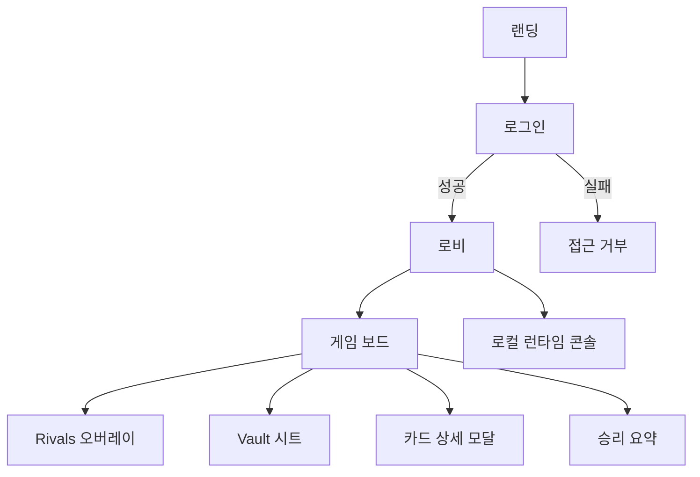

# feat: web UI 전체 문구 한글화

## Overview

현재 `apps/web`의 사용자 노출 문구는 영어와 한국어가 혼재되어 있다. 이번 작업은 현재 노출되는 웹 UI 문구를 전부 한국어로 통일해 일관된 사용자 경험을 제공하는 것을 목표로 한다.

대상 화면:

- `/` 랜딩
- `/auth/login` 로그인
- `/auth/denied` 접근 거부
- `/lobby` 로비
- `/games/[gameId]` 게임 보드 + 오버레이
- `/games/[gameId]/victory` 승리 요약
- `/dev/local-runtime` 로컬 런타임 콘솔

## Problem Statement / Motivation

문구 혼재로 인해 다음 문제가 발생한다.

- 사용자 경험 단절: 같은 앱 내에서 언어 톤이 화면마다 달라진다.
- 운영/QA 비용 증가: 화면별 용어가 제각각이라 검수 기준이 흐려진다.
- 확장성 부족: 현재는 문구가 컴포넌트에 하드코딩되어 있어 이후 문구 변경 비용이 크다.

## Idea Refinement Notes

- 최근 brainstorm(`docs/brainstorms/2026-02-12-solo-bot-hybrid-brainstorm.md`)은 봇 의사결정 주제로 본 작업과 무관.
- 사용자 요청이 명확하므로 추가 정제 질문 없이 계획 수립 진행.

## Research Decision

외부 리서치는 생략한다.

- 작업 성격이 로컬 UI 문구 정리이며 보안/결제/개인정보 고위험 영역이 아니다.
- 코드베이스 내부 컨텍스트만으로 대상 파일/영향 범위를 충분히 특정할 수 있다.

## Repository Research Summary

### 문구가 집중된 주요 파일

- 랜딩: `apps/web/app/page.tsx`
- 로그인: `apps/web/app/auth/login/page.tsx`, `apps/web/src/presentation/auth/LoginForm.tsx`
- 접근 거부: `apps/web/app/auth/denied/page.tsx`
- 로비: `apps/web/src/presentation/lobby/LobbyClient.tsx`, `apps/web/src/presentation/lobby/LobbyTabs.tsx`, `apps/web/src/presentation/lobby/GameList.tsx`
- 게임 화면: `apps/web/src/presentation/game/GameScreenClient.tsx`, `apps/web/src/presentation/game/MarketplaceBoard.tsx`, `apps/web/src/presentation/game/CardDetailModal.tsx`, `apps/web/src/presentation/game/RivalsOverlay.tsx`, `apps/web/src/presentation/game/GemSupplyBar.tsx`, `apps/web/src/presentation/game/VaultSheet.tsx`, `apps/web/src/presentation/game/display-data.ts`
- 승리 화면: `apps/web/src/presentation/victory/VictorySummary.tsx`
- 개발 콘솔: `apps/web/src/presentation/dev/LocalRuntimeConsole.tsx`
- 전역 메타/언어: `apps/web/app/layout.tsx`

### 아키텍처/경계 관점

- `apps/web`는 presentation 레이어로 유지해야 하며 비즈니스 규칙을 추가하면 안 된다.
- 문구 한글화는 presentation 계층 내부 수정으로 충분하며, `packages/rule-engine`/`apps/game-server` 계약 변경이 필요 없다.

### 발견된 구현 리스크

1. 상태 텍스트가 스타일 키로도 재사용됨
- `GameList`는 `statusText`에서 `data-status`를 파생한다.
- 현재 CSS는 `your-turn`, `expiring`, `waiting`, `completed` 값에 의존한다.
- 단순 번역 시 스타일이 깨질 수 있으므로 "표시 라벨"과 "스타일 키"를 분리해야 한다.

2. 문자열 비교 로직 존재
- `GameList`는 `game.statusText === "Your Turn"` 조건을 사용한다.
- 번역 후에도 동작하도록 문자열 비교를 상태 키 기반 비교로 전환해야 한다.

3. 에러 코드 직접 노출
- 일부 화면이 `GAME_NOT_READY`, `HTTP_403` 같은 코드를 그대로 사용자에게 보여준다.
- 최소한 UI 표시는 한국어 친화 문구로 매핑하고, 원본 코드는 보조 정보로 유지하는 정책이 필요하다.

## Institutional Learnings Summary

`docs/solutions`에서 본 작업에 직접 관련된 i18n 사례는 없었다. 다만 다음 운영 원칙을 재사용한다.

- 통합 흐름 보존: UI 변경 시에도 로컬 런타임 주요 플로우(게임 생성/조회/커맨드 전송)가 유지되어야 한다.
- 문서-코드 동기화: 화면 카피 변경 후 README/플로우 설명과 불일치가 생기지 않도록 확인한다.

## SpecFlow Analysis

### 핵심 사용자 플로우



### 누락/위험 포인트

- 시각 스타일 의존 키(`data-status`)와 번역 라벨 결합 해소 필요.
- 버튼/배지의 영어 축약(`VP`, `Pts`, `check`, `lock`)을 한국어로 바꾸면 UI 폭이 늘어날 수 있어 스타일 미세조정 필요.
- `html lang`가 현재 `en`으로 고정되어 있어 `ko`로 변경 필요.

## Proposed Solution

### 1. 문구 소스 단일화

`apps/web/src/presentation/i18n/ko.ts`(신규) 또는 동등한 presentation 전용 상수 파일을 도입해 화면 문구를 중앙 관리한다.

```ts
// apps/web/src/presentation/i18n/ko.ts (pseudo)
export const KO = {
  landing: {
    heroTitleTop: "거래로 길을 열고",
    heroTitleBottom: "권력을 거머쥐세요",
  },
};
```

### 2. 스타일 키와 표시 라벨 분리

`LobbyGameItem`에 내부 상태 키(`statusKey`)를 유지하고, 표시용 라벨(`statusLabel`)을 별도로 둔다.

```ts
// apps/web/src/presentation/lobby/GameList.tsx (pseudo)
data-status={game.statusKey}
<span>{game.statusLabel}</span>
```

### 3. 에러 메시지 표시 정책 정리

사용자 노출 영역은 한국어 설명을 우선 표시하고, 필요 시 괄호로 원본 코드 병기.

예시:

- `"게임을 아직 불러오지 못했습니다. (GAME_NOT_READY)"`
- `"권한이 없습니다. 다시 로그인해 주세요. (HTTP_403)"`

### 4. 전역 언어 설정 정합화

- `apps/web/app/layout.tsx`의 `<html lang="en">`을 `ko`로 변경.
- metadata 설명도 한국어로 변경.

## Technical Considerations

- presentation 레이어 외부로 번역 책임을 확장하지 않는다.
- 서버/룰 엔진 error code enum은 변경하지 않는다(계약 안정성 유지).
- CSS의 `text-transform: uppercase`가 남아 있으면 한글에는 불필요하므로 필요한 컴포넌트에서 제거/조정한다.
- 한글 길이 증가에 대비해 버튼 최소 폭, badge letter-spacing, line-height를 점검한다.

## Implementation Phases

### Phase 1: 문자열 인벤토리 고정

- [x] 화면별 하드코딩 문구 목록 작성 (`docs/plans/...` 체크리스트 기반)
- [x] 번역 용어집(예: Turn, Prestige, Reserve, Vault, Rival) 확정
- [x] 유지할 원문(고유명/ID/에러코드) 기준 확정

### Phase 2: 공통 문구 레이어 도입

- [x] `apps/web/src/presentation/i18n/ko.ts` 생성
- [x] 로비 상태값 구조 분리(`statusKey` vs `statusLabel`)
- [x] 에러코드 -> 한국어 메시지 매핑 유틸 추가

### Phase 3: 화면별 적용

- [x] 랜딩/로그인/접근거부 문구 치환
- [x] 로비/게임/승리/개발 콘솔 문구 치환
- [x] `display-data.ts`의 보석명 등 도메인 표시 라벨 한글화
- [x] `layout.tsx` 언어/메타데이터 한글화

### Phase 4: 테스트/검증 및 마감

- [x] 단위 테스트 보강: 상태키 분리 로직, 에러 메시지 매핑
- [x] 회귀 확인: 기존 테스트 통과
- [x] 수동 QA: 주요 라우트 문구/레이아웃 확인

## Acceptance Criteria

- [x] 위 대상 라우트에서 사용자 노출 고정 문구가 한국어로 표시된다.
- [x] 로비 상태 pill 스타일(`your-turn`, `expiring`, `waiting`, `completed`)은 기존과 동일하게 동작한다.
- [x] 문자열 비교 기반 로직이 상태 키 기반 로직으로 교체된다.
- [x] 사용자 노출 에러는 한국어 설명을 포함한다.
- [x] `apps/web/app/layout.tsx`의 문서 언어 설정이 한국어 기준으로 정합하다.
- [x] `pnpm lint`, `pnpm check-types`, `pnpm test`를 통과한다.

## Success Metrics

- 텍스트 QA 기준: 주요 사용자 플로우에서 영어 UI 문구 0건(예외: 고유명/코드/아이디).
- 회귀 기준: 기존 웹 테스트 스위트 100% 통과.
- 유지보수 기준: 신규 문구 추가 시 중앙 문구 파일에서 우선 관리 가능.

## Dependencies & Risks

### Dependencies

- 디자인 톤 일관성을 위한 번역 용어 합의(간단 용어집).
- 로비/게임 화면 스타일 검증 시간 확보.

### Risks

- 문구 길이 변화로 버튼/배지 overflow 발생 가능.
- 일부 영어 축약어를 한글화할 때 가독성이 오히려 떨어질 수 있음.
- 개발 콘솔은 내부 디버깅 목적이므로 지나친 번역이 오히려 디버깅 속도를 저하시킬 수 있음.

### Mitigation

- 상태 키/스타일 키는 영어 내부 코드 유지.
- UI 라벨만 한국어화하고 디버그 식별자(커맨드 타입, 에러 코드)는 병기.
- 모바일 폭(360px) 기준 수동 레이아웃 점검 체크리스트 추가.

## Test Plan

### 자동 검증

```bash
pnpm lint
pnpm check-types
pnpm test
```

### 수동 검증

- [x] `/` 랜딩: Hero/CTA/Feature 카드 모두 한글
- [x] `/auth/login`: 라벨/버튼/보조 문구 한글
- [x] `/auth/denied`: 오류 안내/CTA 한글
- [x] `/lobby`: 탭/목록/컨트롤 패널 한글
- [x] `/games/[gameId]`: 보드/모달/오버레이/패널 한글
- [x] `/games/[gameId]/victory`: 승리 요약/리더보드/CTA 한글
- [x] `/dev/local-runtime`: 콘솔 섹션 라벨 한글, 명령 식별자는 필요 시 코드 병기

## References

- 아키텍처 기준: `ARCHITECTURE.md`
- 경계 규칙: `docs/concerns-and-boundaries.md`
- 에이전트 운영 규칙: `docs/agent-harness.md`
- 품질 기준: `docs/quality/QUALITY_SCORE.md`
- 관련 계획: `docs/plans/2026-02-13-feat-web-reference-multiscreen-ui-plan.md`
